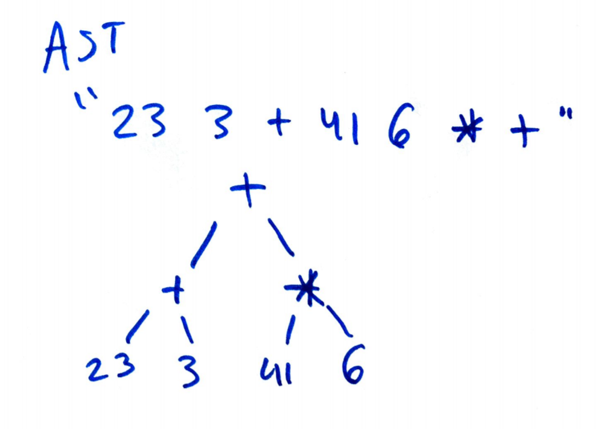

# Problem 1

## Part 1

```L(R) = (a|b)(a|b)(a|b)```

1. "aaa"
2. "aab"
3. "aba"
4. "abb"
5. "baa"
6. "bab"
7. "bba"
8. "bbb"

## Part 2

```L(R) = a(aa|bb)*b```

This set will be infinite, so I will write down the 7 shortest.

1. "ab"
2. "aaab"
3. "abbb"
4. "aaaaab"
5. "aaabbb"
6. "abbbbb"
7. "aaaaaaab"

# Problem 2

## Part 1

Write a regular expression with non empty binaries that start and end with the same digit.

```L(R) = ((1(1|0)*1)|(0(1|0)*0))```

## Part 2

Write a regular expression for declartions of variables of type int.

```L(R) = int\sID(,ID)*=(ID|N)(,(ID|N))*```

# Problem 3

## Part a

Expr -> Expr Expr - | Expr Expr + | Expr Expr * | Expr Expr / | N

## Part b

```{r, out.width = "400px", echo=FALSE}

```

## Part c

```
Expr -> Expr Expr + -> Expr Expr Expr * + -> Expr Expr N * + ->
Expr N N * + -> Expr Expr + N N * + -> Expr N + N N * + ->
N N + N N * + -> N N + N 6 * + -> N N + 41 6 * + ->
N 3 + 41 6 * + -> 23 3 + 41 6 * +

```

# Problem 4

Paren -> $\epsilon$ | Paren () | () Paren | ( Paren )

# Paroblem 5

## Part a

This language is ambigious. The definition of F has it on either side of an operator. A revised unambigous grammar would be:

```
E -> E + F | F
F -> F * G
G -> Id | (E)
```

This creates a left associativity in the grammar for both the + and * multipliers, and the + multiplier has a lower precedence.

## Part 2

This language is unambigous. The union operator has a lower precendence than the intersenction operator. The union operator has right associativity and the intersection operator has a left associativity.


