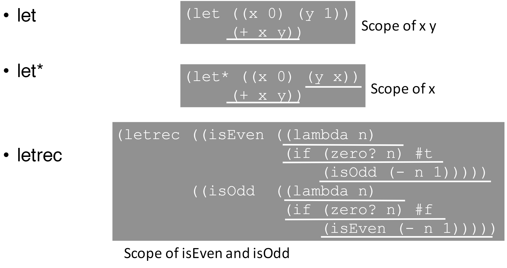
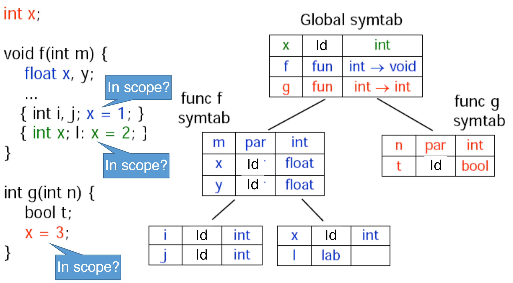
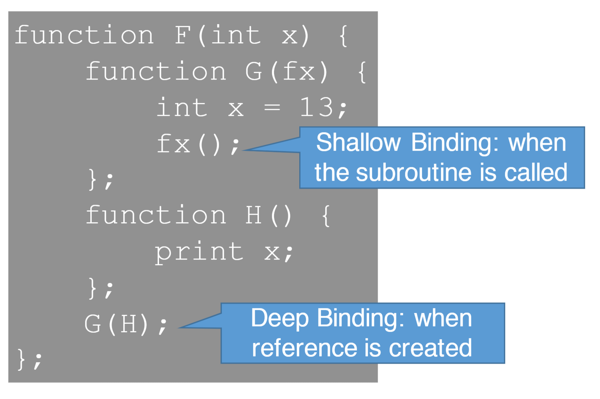
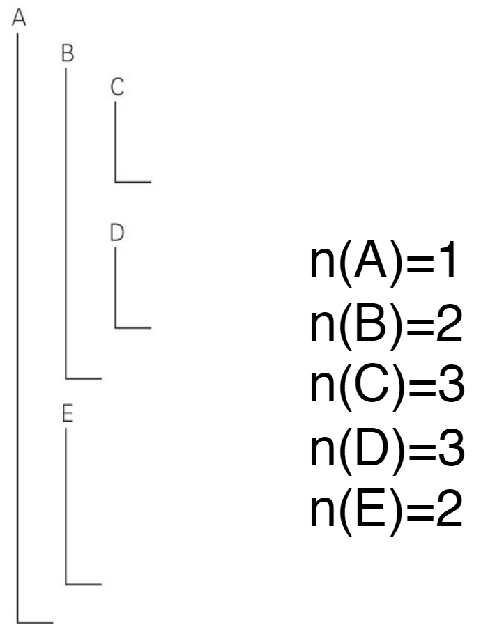
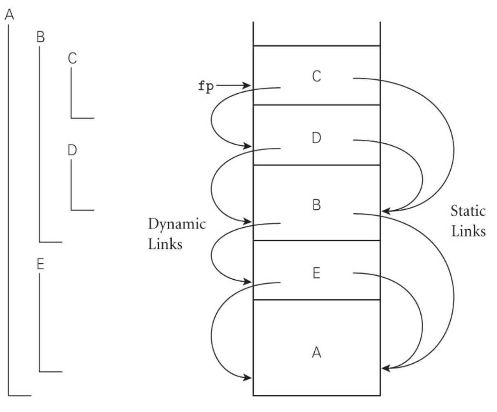
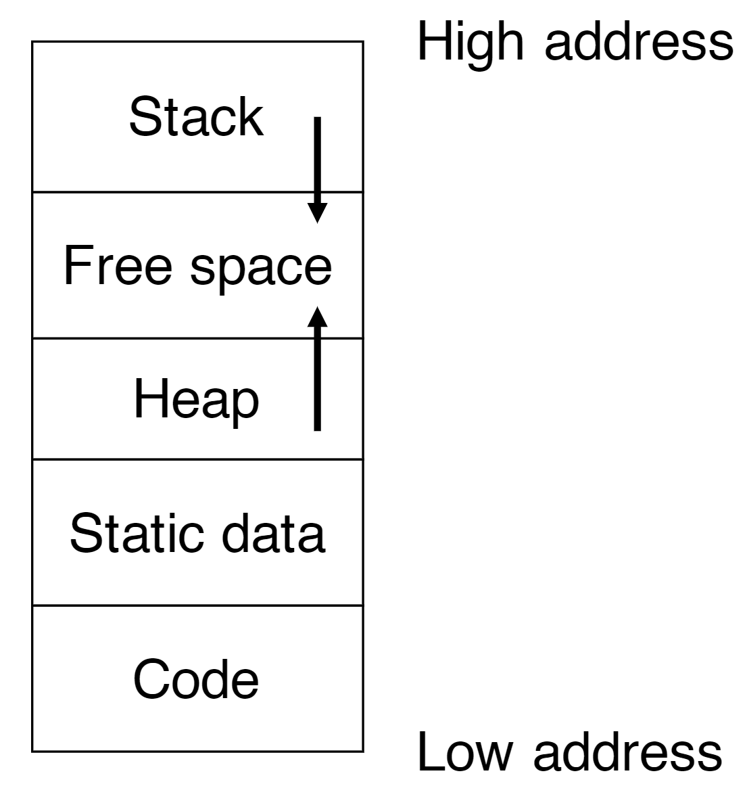
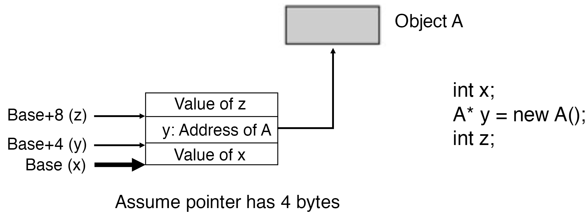
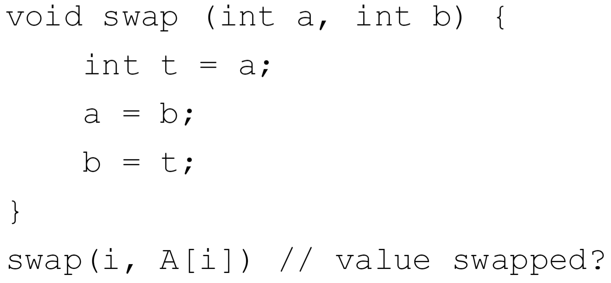

# Scope

Scope is the visibility of variable names in a source program. This visibility can be determined at run-time or statically.

## Symbol Table

A symbol table is a table of names and their bindings. A single scope can be seen as a dictionary or hash map, but a nested scope is depicted as a tree of symbol tables. Each scope has one symbol table and each symbol table may have a parent.

## Static

Static scoping is also known as lexical scoping. In this scoping scheme the compiler determines the scope by examining the source code. This is used in most languages including C, Java, and Scheme.

```{r, out.width = "400px", echo=FALSE}

```

```{r, out.width = "400px", echo=FALSE}

```

## Dynamic

Dynamic scoping has to do with function calls. Dynamic scoping is determined at run time, and the callee symbol table has the caller as a parent. This tree would be a single trunk.

## Binding: Shallow vs Deep

A shallow binding creates link when function is called, while deep binding creates link depending on where function is defined.

```{r, out.width = "400px", echo=FALSE}

```

## Links

When determining links **nested depth** is very important. n(p), the nested depth of a function, are their distance from a function that is not nested (top-level), which is denoted as 1. A link determines the links of symbol tables when a link from A to B denotes that B is the lexical ancestor of A in static scoping. A dynamic link is easy to find, because it just points to the caller of the callee.

```{r, out.width = "200px", echo=FALSE}

```

### Determining Static Link

Static links are determined using the nested depth as previously mentioned.

1. B calls D and n(B) < n(D): B is immediate ancestor of D. Static link is dynamic link.
2. B Calls D and n(B) >= n(D): follow B for n(B) - n(D) + 1 hops on static links.

```{r, out.width = "200px", echo=FALSE}

```

# Lifetime

The lifetime of a variable is directly related to the scope. As long as a variable exists in a symbol table it is considered to be alive. The lifetime usually corresponds to the lifetime of the function the variable is declared in.

# Memory Storage

```{r, out.width = "200px", echo=FALSE}

```

### Variable Declaration

When variables are declared their default values vary depending on the language implementeation. They can either point to a null value, or like numbers in C, be instantiated to a value. Numbers in Java and C are 0 by default, and strings are empty by default ("").

## Static

Supports storage of any variables that exist for the duration of the program. This includes variables declared in the global scope, because they exist for the duration of the program.

## Stack

The stack is mostly used to store activation records or frames. A single activation record corresponds to the function call, which is why infinite recursion functions have a stack overflow. The stack also has two pointers to help with storage access. The frame pointer indicates the location of the current activation record, and the stack pointer points to the next available free space.

An activation record contains the following information:

* Local variables
* Temporaries
* Return values
* Bookkeeping info
* Arguments (to the callee)

## Heap

The heap contains dynamic variables and objects that the programmer controls. This is where objects are contained when a programmer uses a constructor in Java to create a varaible. Pointers/references to the variable are stored in the stack which point to the actual object held within the heap portion.

```{r, out.width = "400px", echo=FALSE}

```

# Tail Recursive Functions

## Definition

A tail recursive function is a function that calls itself as the very last thing: the result of the function is a recursive call. This property makes these types of functions equivalent to a loop.

## Optimization

This enables the function to be more efficient both space wise and time wise. Space wise a non-tail recursive function must create a new activation record that has a separate return value and data in it, but with tail-recursion the only value chaging is the return values or variables in scope of the function. This is what a loop does, so you do not need more than a single frame in the stack, which also means no calling of other functions has to occur, which limits call time overhead.

# Parameter Passing

**Formal** parameters are the identifiers used in a method or function to stand for the value passed in by a caller. **Actual** parameters are the actual value passed by the caller.

## Call By Value

Call by value uses the values of the actual parameters passed to the function, but changes the actual parameters in no way.

### Calling Mechanism

* Arguments evaluated to their values
* Memory or registers allocated for arguments on Activation Record (AR)
* Argument **values** copied to AR
* AR destroyed when callee returns

### Characteristics

* Acutal parameters may not be directly changed by callee
* Arguments can be complex expressions
* Simple and intuitive (less error-prone)

### Performance

* Primitive types: cost per parameter is small
* Constructed types: copying values is slow
* C: programmer must pass pointers to avoid copying cost
* Java: uses CBV for primitive and CBR for constructed

## Call By Value Return (In-Out)

### Calling Mechanism

* Arguments are evaluated to their values
* Memory or registers allocated for arguments on AR
* Argument values stored in AR
* Before callee returns, **AR values copied back to actual arguments**
* AR destroyed when callee returns

### Characteristics

Mostly identical to Call By Value, but there is an extra step of copying values back to actual parameter.

### Performance

Mostly identical to Call By Value, but copying cost happens twice, once on call and once on return.

## Call By Reference

### Calling Mechanism

* Arguments are evaluated to their values
* Memory or registers allocated for arguments on AR
* Argument **address** stored in AR
* AR destroyed when callee returns

### Characteristics

* Formal parameter is merely an alias of actual parameter, since they point to the same memory
* Actual parameters may directly be changed in callee
* Some language disallows complex expression as arguments
* Programs are harder to understand (more error-prone)

### Performance

CBR avoids the copying cost of CBV. In C CBR is the default mode, but in Java it is used only for constructued types such as arrays.

## Call By Name (Lazy Evaluation)

### Calling Mechanism

* Arguments are **not evaluated to their values** (like macros)
* Actual parameters replace all formal parameters in body

### Characteristics

```{r, out.width = "400px", echo=FALSE}

```

# Types

## Two's Complement

## Union Type

### Compiler Memory Layout

## Struct Type

## IEEE 32-bit Floating Point

### Sign

### Exponent

### Mantissa

# Type Systems

Rules needed will be given according to professor.

## Typing Rules

## Proof Tree

## Constraints


