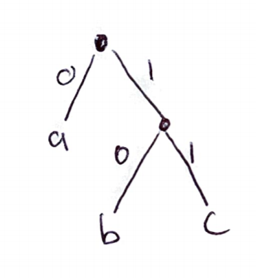
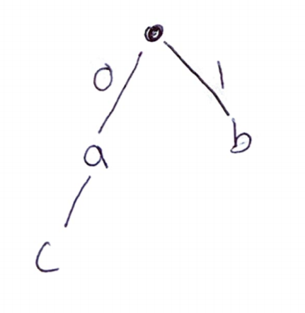
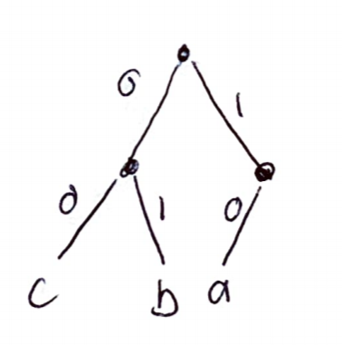

# Problem 1

## Part 1

This greedy algorithm is correct. We already know the problem can be broken down into a greedy heuristic, because that is what is given as the algorithm. Let's take a look at the greedy choice property, which states that the optimal global solution must contain the greedy choice at any given step. Clearly this will hold true, because by choosing the earliest deadline we are guaranteeing that only tasks that share a deadline with another task will be not completed. While yes this minimizes the number of penalties incurred the tiebreaker helps to ensure that the greedy choice is part of the global optimum, because by choosing the higher penalty in a tiebreaker, you are essentially agreeing that if that duplicate cannot be completed on time you want to incurr the job with the lesser penalty. In this same way the problem would have optimal substrucutre, because you are moving forward in time. Figuring out the optimal solution for a set of jobs in the first two seconds, and then adding the greedy choice for the set of jobs that would be available in the third point in time would provide an optimal solution globally.

\pagebreak

## Part 2

This greedy algorithm will fail. With the following example the algorithm would choose task 2, then 3, then tag on 1. The penalty would be 4 for not completing task 1 in time, but all 3 tasks could have been completed on time with deadlines of 1, 3, and 2. This algorithm does not properly account for the importance of time.

$$
\begin{tabular}{c | c c c }
\hline
 $p_i$ & 4 & 5 & 3 \\ 
\hline
 $d_i$ & 1 & 3 & 2 \\  
\hline
 i & 1 & 2 & 3    
\end{tabular}
$$

\pagebreak

## Part 3

This greedy algorithm will fail. With the following example the algorithm would choose task 2, then 3, then tag on 1. The penalty would be 5 for not completing task 1 on time, but all 3 tasks could have been completed on time with deadlines of 1, 3, and 2. This algorithm does not properly account for the importance of time.

$$
\begin{tabular}{c | c c c }
\hline
 $p_i$ & 5 & 15 & 10 \\ 
\hline
 $d_i$ & 1 & 3 & 2 \\  
\hline
 i & 1 & 2 & 3    
\end{tabular}
$$

\pagebreak

# Problem 2

It is not possible for a minimum spanning tree and a shortest path tree from s to not share any edges. For any graph G, the lightest edge that is incident upon s will be included in both trees. You know this would be in the shorest path tree, because of how Dijkstra's algorithm runs, where the next node that the algorithm runs on after the intial node s, is the node with the lightest weight directly connected to s. This edge is also in the minimum spanning tree, which we know from the claim used to prove that Kruskal's algorithm works. The lightest edges across any cut of G will be in the MST of G. If the cut is the single vertex s and then everything in V that is not s, then the shorest path from the tree to that edge s would be the lightest edge.

\pagebreak

# Problem 3

The output desired from this problem is the lightest spanning tree where the set of verticies in U are leaves of the lightest spanning tree. The lightest tree that would involve the vertices in U as leaves in the tree would create a minimum spanning tree of the graph that does not include the vertices in U. Using this idea what you could do is run Kruskal, but skip any edges that contain a vertex in U. After all vertices not in U have been added you have a minimum spanning tree of the graph G', all vertices and edges that are not incident upon vertices in U. From here you can just add the vertices in U with the same method as Kruskal, aka adding the lightest edges first that include the vertices in U. This algorithm would have the same running time as Kruskal's or $O(|E|log|V|)$.

\pagebreak

# Problem 4

## Part a

"b" and "c" in the given code would be 2 levels below the root node of the full binary tree and "a" would be 1 level below. This is the tree obtained in the greedy algorithm where are heuristic was to add the lowest frequencies to the tree first. This implies that $f_a > f_b;f_z > f_c$. The full tree is illustrated below.

```{r, out.width = "400px", echo=FALSE}

```

\pagebreak

## Part b

This code cannot possibly be obtained. This code contains prefixes meaning that the code for a is the prefix for the code for c. For example, if you had "00" in an encoded string of bits, then the code code either mean "aa" or "c", which means the code is ambigious and not possibly obtained from Huffman encoding. This is also not possible in the Huffman encoding algorithm, because it implies a letter was used where an inner node is and not as a leaf, which is not possible in the algorithm, which combines two letters to make an inner node. An illustration is below.

```{r, out.width = "400px", echo=FALSE}

```

\pagebreak

## Part c

This code cannot possible be obtained with the Huffman algorithm. Although it is a valid code, it does not follow the way the greedy approach is setup. The herutisitc that the algorithm runs on is to add the two lowest frequencies to the tree next by combing those two nodes with a parent node. The fact that "a" is listed as 10 implies there would be another encoded letter at 11, but there is not so "a" would have to be just 1 to change this to a code obtainable from Huffman encoding. An illustration is below.

```{r, out.width = "400px", echo=FALSE}

```


