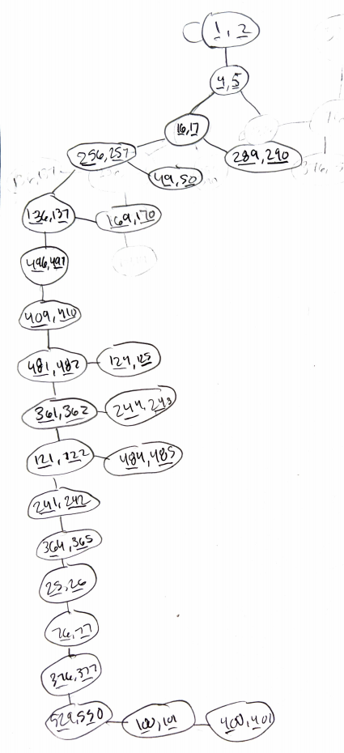

# Problem 1 Pre and Post Processing

## Part 1a

\pagebreak

## Part 1b

\pagebreak

# Problem 2 Funny Money

To find a combination to obtain a 10$ bill, we can create a DFS tree. Since there are only two options, connected to each node, it the tree is a binary tree. Leaves occur when both choice nodes already appeared as an ancestor to that node. We want a node that gives us [10, 11], since that means we currently can get a 10 dollar bill. An example of the tree can be found below.

{ height=50%, width=50%}

According to this DFS tree I made of the possible options, there is no way to obtain a $10 bill through the printing machine starting with a 1 dollar bill.

\pagebreak

# Problem 3 Topological Ordering

## Part 3a

* A - [1, 14]
* B - [15, 16]
* C - [2, 13]
* D - [3, 10]
* E - [11, 12]
* F - [4, 9]
* G - [5, 6]
* H - [7, 8]

\pagebreak

## Part 3b

The sources of the DAG are A and B. The sinks of the DAG are G and H.

\pagebreak

## Part 3c

1. B
2. A
3. C
4. E
5. D
6. F
7. H
8. G

\pagebreak

## Part 3d

\pagebreak

# Problem 4 One-Way Streets

## Part 4a

\pagebreak

## Part 4b

\pagebreak

# Problem 5 City Hopping

## Part 5a

\pagebreak

## Part 5b

