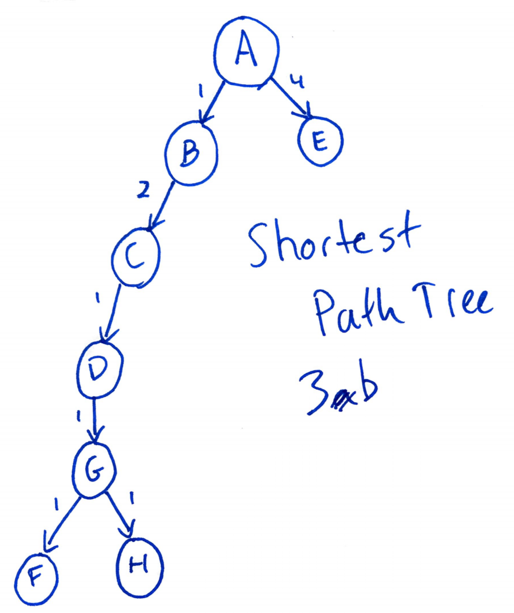

# Problem 1 

A back edge in a BFS algorithm would designate a cycle in a directed graph. This cycle would include the ancestor through the descendant in the tree. This means all one has to do is run a BFS algorithm, which takes O(|V| + |E|) time and look for edges (v, w) that have depth(v) > depth (w) (back edge). If this edge has depth(w) - depth(v) % 2 == 1 then you can increment the count of number of odd-length cycles. This second part of the algorithm looking for the odd-length cycle is a single loop through the edges so the algorithm takes O(|V| + 2|E|) time or O(|V| + |E|) time, which is linear.

\pagebreak

# Problem 2

## Part a

In BFS it is impossible to have a forward edge, because the algorithm searches breadth first. This means if you start at root node A, then the algorithm will look at all of A's outgoing edges and add the nodes at the other side as children of A. This means the algorithm could not find a node that has an edge with A that is not a child of A, so there cannot be any forward edges in the BFS tree. All edges from A, must a child, so it cannot fulfill the definition we gave for a forward edge: a BFS forward edge leads from a node to a nonchild descendant in the BFS tree. All edges must be a child descendant.

\pagebreak

## Part b

To determine edge type in the BFS tree you can run BFS and use the edges and depth values from the algorithm. If there exists an edge (v, w) and depth(v) + 1 = depth(w), then v (v, w) is a tree edge, which can be classified as such during the run of the BFS algorithm. Any edge (v, w) with depth(v) = depth(w) or depth(v) + 1 = depth(w) is a cross edge, if it was not designated a tree edge during the running of the BFS algorithm. A back edge is any of the remaining edges or when the edge (v, w) has depth(v) > depth(w). Since we have a BFS portion in O(|V| + |E|) and portion where we go through the edges in O(|E|) we have a running time of O(|V| + 2|E|) or O(|V| + |E|) running time. A crucial part to differentiating between cross and tree edge is making sure to designate the tree edges while the standard BFS algorithm is running.

\pagebreak

# Problem 3

## Part a

$$
\begin{array}{ |c|c|c|c|c|c|c|c| }
 \hline
 A & B & C & D & E & F & G & H \\
 \hline
 0* & \infty & \infty & \infty & \infty & \infty & \infty & \infty \\
 0 & 1* & \infty & \infty & 4 & 8 & \infty & \infty \\
 0 & 1 & 3* & \infty & 4 & 7 & 7 & \infty \\
 0 & 1 & 3 & 4* & 4 & 7 & 5 & \infty \\
 0 & 1 & 3 & 4 & 4* & 7 & 5 & 8 \\
 0 & 1 & 3 & 4 & 4 & 7 & 5* & 8 \\
 0 & 1 & 3 & 4 & 4 & 6* & 5 & 6 \\
 0 & 1 & 3 & 4 & 4 & 6 & 5 & 6* \\
 \hline
\end{array}
$$

\pagebreak

## Part b

 { width=70% }

\pagebreak

# Problem 4

The method suggested by Prof F. Lake does not work. With negative edges Dijkstra's method breaks, because it is based on the idea that all future edges will cause in increase to distance. For example, if I have a graph with nodes (A, B, C) and edges [(A,B), (A,C), (B,C)] with weights [10, 5, -6]. The shortest path from A to C is 4 from A to B then B to C, so the shorest path must go through B, but if we add 7 to each edge and run Dijstra we get distances of 0 for A, 7 for B, and 12 for C from directly A to C, since with positives values A to B to C has a distance of 1 + 17 = 18. Therefore Prof Lake's method is not valid.

