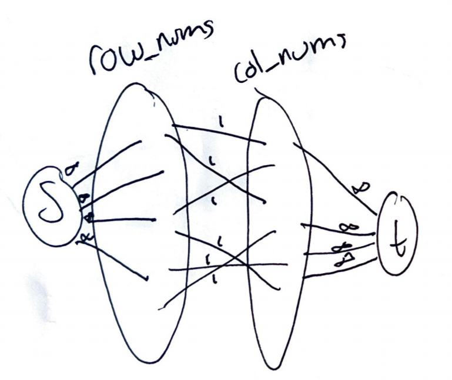

# Problem 1 Shortest Path

Collaborators: GeeksForGeeks Dial's Algorithm

Recall that in Dijkstra's algorithm it includes O(|V|) Get Min operations from the priority queue and O(|E|) insert/decrease key operations. This implies that we want the running time of both operations in our priority queue to be O(logW) to get the running time noted. The reason we should use a modified Dijkstra algorithm, is because we are looking at finding the shortest path solution.

For this algorithm we should operate the priority queue as a heap, but instead of this heap being the nodes in the queue they have to do with current edge weights. In this case we operate a min binary heap that includes all of the current edge weights to nodes. For example if we have a source node with three edges coming out with distances of 1, 2, and 3, then our min heap has those edges in the heap, ordered by their edge weight plus the distance to the current node, since with Dijkstra we will be working from the node that the shortest path has already been found. Working with the edges in a binary min heap would give you log(W) time to insert/decrease key and log(W) time to get the minimum. This would give this updated Dijkstra's algorithm a running time of O((|V|+|E)log(W)).

\pagebreak

# Problem 2 Roads and Planes

We want the shortest path between two cities s and t in this graph of roads and planes. Planes have directed edges that can be negative, and roads have undirected edges that are positive. Any two vertices connected by a plane route are two separate strongly connected components in the graph, implying a negative cycle is not possible. We want to find the shortest path using an algorithm that is as efficient as Dijkstra's.

Since we know that each plane route connects strongly connected components, then if there is a plane route between s and t, we must take that plane route. This creates a macro DAG, where we have the value of the plane routes to account for, but in each SCC we need to find the shortest path from plane to plane, therefore what we could do is first find the shorest path within each connected component, and then add that distance to the weight of any outgoing edges of that component essentially creating a with updated edge weights. The algorithm would be as follows:

```
Input: G, l, s
Output: dist(t)

Create a set CC of connected components
for all vertices v in V, set dist(v) to infinity
set dist(s) to 0
make Q, priority queue of V

for each cc in CC:
  v = deleteMin(Q)
  Dijkstra(v, G) # find min path through component
  for each edge p in P: # plane edges
    dist(p) = l(v, p) + l(p, u) # where u is plane destination
  update(G) # so G has the SCC as single node

Dijkstra(s, G) # find shortest path through dag
return dist(t)
```

Since this algorithm has Dijkstra as the highest growth rate part of the algorithm it would have the same running time (even though it runs Disjkstra multiple times growth rates do not look at coeffficients.)

\pagebreak

# Problem 3 Couple Pairing

We are given two sets A and B, who are boys and girls. We want to determine if it is possible to find a matching with k pairs. We can do this using a modified Ford-Fulkerson algorithm, where the weight of every possible matching in the set E (also called C) is 1. Since all the edges are identically a weight of 1, we will always be adding the same possible value to the flow count. This flow count is essentially equivalent to the number of matches we can make. This means that on each iteration we should check if we have at least k matches. If we do then we can return true, if after the max flow is found the flow count is less than k, then the algorithm would return false. This means we will run in O(max_flow * |E|) for the Ford-Fulkerson, but we have a trigger to stop the running time at k, which makes the running time O(k |E|). |E| in this case would be the number of possible matches C making our run time O(kC).

```{r, out.width = "400px", echo=FALSE}

```

\pagebreak

# Problem 4 Matching Rocks

We can frame this problem in a bipartite graph. The vertices in a set A are the row numbers 1 through m. The vertices in a set B are the row numbers 1 through n. You can then add an edge for every usable square so for example if the space 4,6 is usuable you put an edge from vertex 4 in A to vertex 6 in B, but if space 5,1 is not usable then you do **not** add an edge. You know have a bipartite graph whose possible matchings are the usable squares on the board. If you want to find the maximum number of rooks you can place then you merely need to take this bipartite graph and run a maximum cardinality matching algorithm, such as Ford-Fulkerson, but in order to run that, since it looks for maximum flow, you would have to designate edge weights of 1 and add a single source going into set A and a single sink coming out of set B. This algorithm would run in O(max_flow * |E|) time.

```{r, out.width = "400px", echo=FALSE}

```


