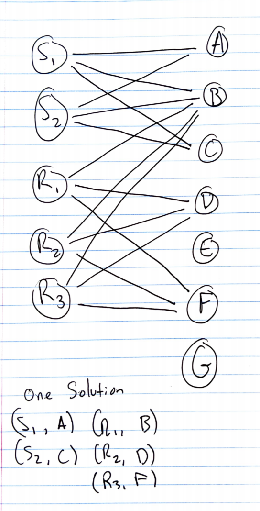
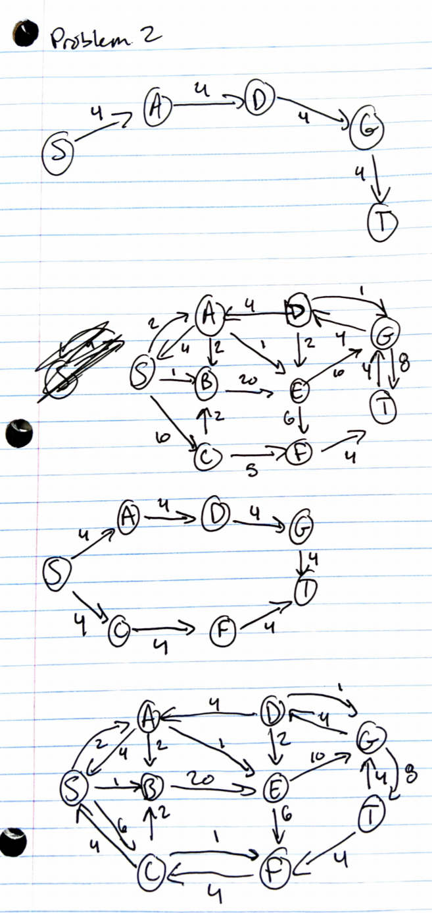
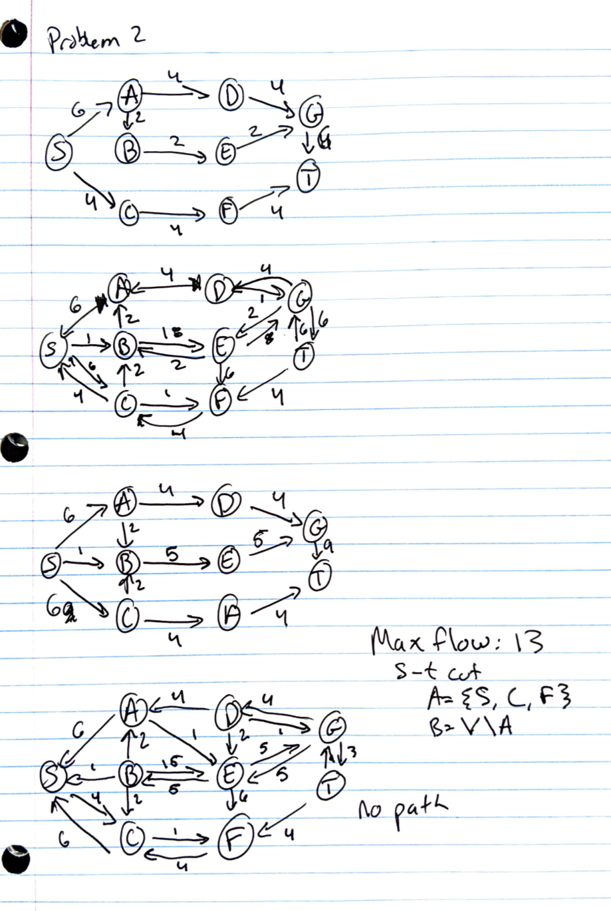

Collaborators: None

# Problem 1

This problem requires matching classes to fulfill requirements. You could solve this problem by setting up a bipartite graph, where a set A has vertices $S_i$ where S is a class requirement set, and i is the ith class requied in that set. The other set, set B, has classes as the vertices. For the simple example in the problem with x = 2, and S = {B, C, D, F}, A would have $S_1$ and $S_2$ which are both connected to every class in set B = {B, C, D, F}. From here you can run the Ford-Fulkerson algorithm by phrasing this maximum cardinality problem as a flow problem to find the maximum matches. I included an example graph below with more than one set, where it is clear that this can be solved through maximum cardinality matching. (The example graph requires x=2 from S={A,B,C} and x=3 from R={B,D,F}).

```{r, out.width = "400px", echo=FALSE}

```

\pagebreak

# Problem 2

The maximum flow in the graph below from s to t is 13. The corresponding cut from the is A = {S, C F} and V not in A. Below is my iteration through Ford-Fulkerson.

```{r, out.width = "400px", echo=FALSE}

```

```{r, out.width = "400px", echo=FALSE}

```

\pagebreak

# Problem 3

To find the k edges to delete to minimize the max flow in the graph we would want to look at the minimum cut. By deleting edges from the minimum cut we would reduce the max flow by 1 for each edge deleted, since the minimum cut is what determines the larges possible flow (since you can't fit any more through). The algorithm you could use to do this is first run Ford-Fulkerson to find the max flow of the graph. At the end of finding the max flow look at the residual graph you have made. Create a subset of edges in E called E' that have the following property: the edges in E' are edges going out of vertices in a set S, where S is a set of all verticies reachable by the source vertex s. The edges must also satifiy the condition that they are going into a vertex not in S, which implies they are crossing the minimum cut of the graph and are therefore going to decrease the capacity when you remove them from the graph. Even if you have a k greater than the number of edges in E' by the time you delete all edges in E' the flow will be zero and you cannot go any lower (so k > than the flow). This algorithm essentialy has the same polynomial running time as Ford-Fulkerson.

\pagebreak

# Problem 4

\pagebreak

# Problem 5

## Part a

\pagebreak

## Part b

\pagebreak

## Part c


