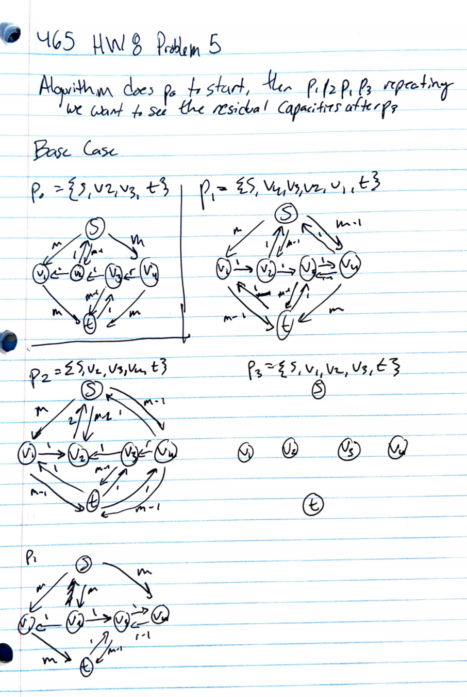

Collaborators: None

# Problem 1

This problem requires matching classes to fulfill requirements. You could solve this problem by setting up a bipartite graph, where a set A has vertices $S_i$ where S is a class requirement set, and i is the ith class requied in that set. The other set, set B, has classes as the vertices. For the simple example in the problem with x = 2, and S = {B, C, D, F}, A would have $S_1$ and $S_2$ which are both connected to every class in set B = {B, C, D, F}. From here you can run the Ford-Fulkerson algorithm by phrasing this maximum cardinality problem as a flow problem to find the maximum matches. I included an example graph below with more than one set, where it is clear that this can be solved through maximum cardinality matching. (The example graph requires x=2 from S={A,B,C} and x=3 from R={B,D,F}).

```{r, out.width = "400px", echo=FALSE}
knitr::include_graphics("./requirementGraph.png")
```

\pagebreak

# Problem 2

The maximum flow in the graph below from s to t is 13. The corresponding cut from the is A = {S, C F} and V not in A. Below is my iteration through Ford-Fulkerson.

```{r, out.width = "400px", echo=FALSE}
knitr::include_graphics("./FlowGraph1.PNG")
```

```{r, out.width = "400px", echo=FALSE}
knitr::include_graphics("./FlowGraph2.PNG")
```

\pagebreak

# Problem 3

To find the k edges to delete to minimize the max flow in the graph we would want to look at the minimum cut. By deleting edges from the minimum cut we would reduce the max flow by 1 for each edge deleted, since the minimum cut is what determines the larges possible flow (since you can't fit any more through). The algorithm you could use to do this is first run Ford-Fulkerson to find the max flow of the graph. At the end of finding the max flow look at the residual graph you have made. Create a subset of edges in E called E' that have the following property: the edges in E' are edges going out of vertices in a set S, where S is a set of all verticies reachable by the source vertex s. The edges must also satifiy the condition that they are going into a vertex not in S, which implies they are crossing the minimum cut of the graph and are therefore going to decrease the capacity when you remove them from the graph. Even if you have a k greater than the number of edges in E' by the time you delete all edges in E' the flow will be zero and you cannot go any lower (so k > than the flow). This algorithm essentialy has the same polynomial running time as Ford-Fulkerson.

\pagebreak

# Problem 4

This problem can be modelled as a graph where the set of vertices V, are the cities and the set of edges E are railways connecting each city. As stated above we have a subset of V called T, which are safe cities and the sinks of our directed graph, and a subset of cities S where a spy i is stationed in the vertex $s_i$. A way to convert this to a max flow problem would be to take this graph and make each city a set of 3 verticies (with the exception of S and T that would have 2), where there is a into city X vertex, the actual city X vertex and out of city X vertex. THe into vertex would have all railway routes in with infinite capacity, but then link to the actual city vertex with capacity c (the max number of spies allowed to pass through a given city), and the out of vertex would be modeled the same way, but with a edges from the city vertex of weight/capacity c and all possible outgoing railways out of it with infinite verticies. This ensures at most c spies can pass through a given city and you can then solve the max flow problem to see what the escape routes could be, if they existed. Below is a diagram of the graph in a general format.

```{r, out.width = "400px", echo=FALSE}
knitr::include_graphics("./FlowGraph2.PNG")
```

\pagebreak

# Problem 5

## Part a

The maximum flow of the graph must be 2m + 1. You can send m through (s, $v_1$) and ($v_1$, t), and you can send another m through (s, $v_4$) and ($v_4$, t). This leaves one outgoing edge from s (s, $v_2$), since the other two edges out of s are already at capacity. This leaves the bottle neck value of 1 on the path from (s, $v_2$), ($v_2$, $v_3$), and ($v_3$, t). This implies a minimum cut of S = {s, $v_1$, $v_2$} and V not in S, which must be true, because you cannot get a smaller value with any other cut. Look at the cut values:

* Just s in S would be 3m
* Just t in V not in S would be 3m
* S = {s, $v_1$}  would be 3m
* S = {s, $v_4$} would be 3m + r
* S = {s, $v_2} would be 2m + 2
* S = {s, $v_1$, $v_4$} would be 2m + r
* S = {s, $v_2$, $v_3$} would be 3m + 1
* S = {s, $v_2$, $v_4$} would be 2m + r + 2
* S = {s, $v_1$, $v_2$, $v_3$} would be 3m
* S = {s, $v_2$, $v_3$, $v_4$} would be 3m + 1

\pagebreak

## Part b

```{r, out.width = "400px", echo=FALSE}

```

\pagebreak

## Part c


