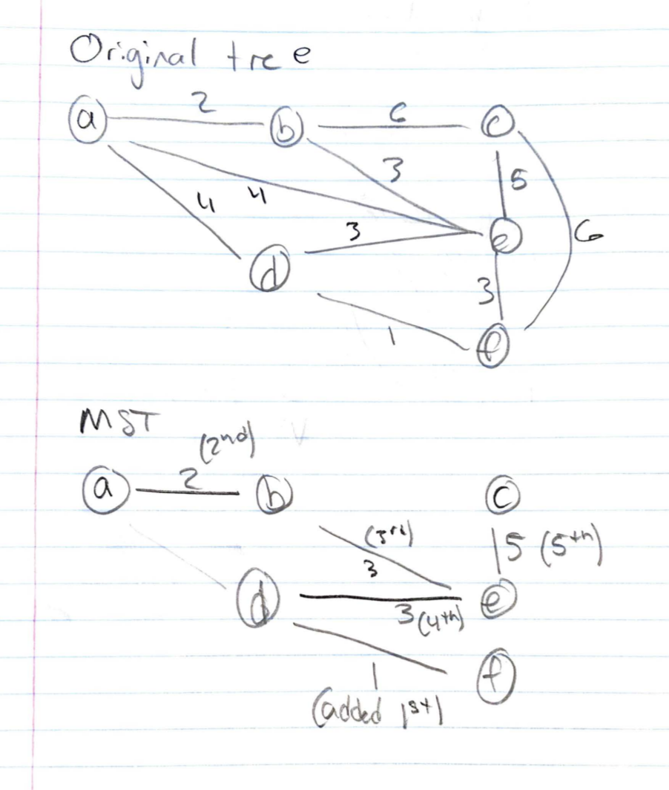
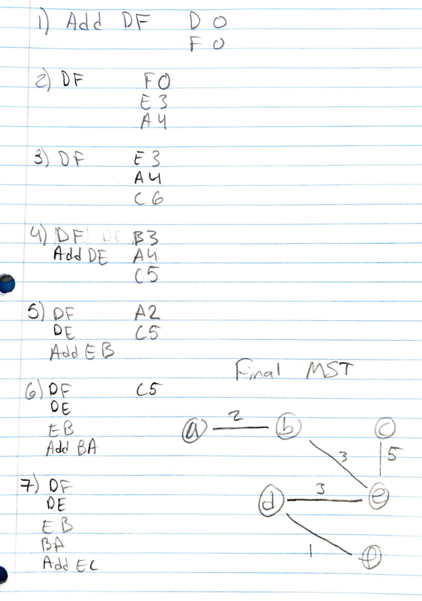

# Problem 1

Collaborators:

\pagebreak

# Problem 2

## Part 1

\pagebreak

## Part 2

\pagebreak

## Part 3

\pagebreak

## Part 4

\pagebreak

# Problem 3 Kruskal's Algorithm

Algorithm by iteration:

1. FD (Cut (S = {F}, V - S))
2. AB (Cut (S = {F, D, A}, V - S))
3. BE (Cut (S = {F, D, A, B}, V - S))
4. DE (Cut (S = {F, D}, V - S))
5. CE (Cut (S = {A, B, D, E, F}, {C}))

Final MST:

```{r, out.width = "400px", echo=FALSE}

```

\pagebreak

# Problem 4 Prim's Algorithm

```{r, out.width = "400px", echo=FALSE}

```

\pagebreak

# Problem 5


