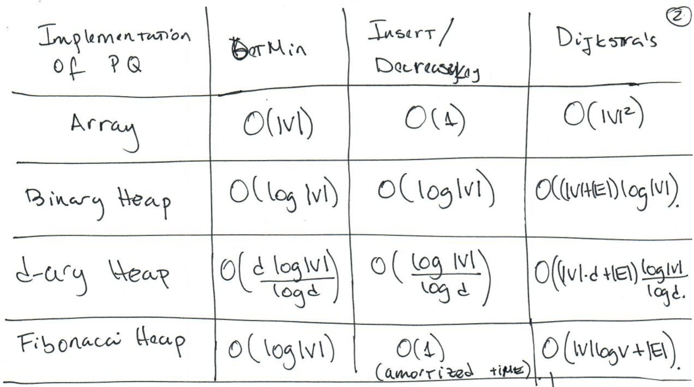
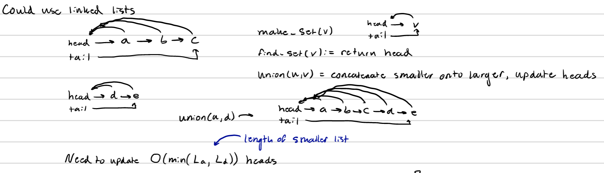
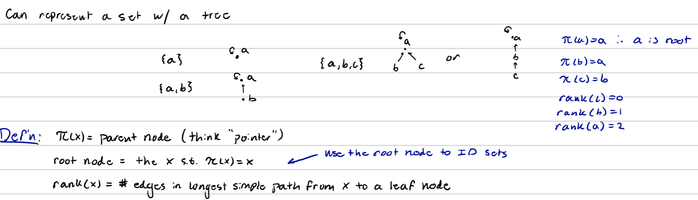

# Shortest Path

## Dijkstra's Algorithm

Use a priority queues and update path distances starting from minimum unfinalized vertex.

### Algorithm

```{}
Dijkstra(G, l, s) {
  Input: Graph g, weights l, source vertex s
  Output: distance to each vertex from s
  
  dist = new int[|V|]
  for each v in V {
    dist[v] = inf
  }
  dist[s] = 0
  R = {s}
  # create queue
  # get min value of q aka s
  for (i = 1 to |V|) {
    pop min distance vertex not in R # use getMin from PQ
    foreach (v, z) in E {
      if (dist[z] >= dist[v] + l(v, z)) {
        dist[z] = dist[v] + l(v, z)
        # update keys in queue (insert if inf)
      }
    }
  }
  
  return dist
}
```

### Running Time

$O(|V|^2)$ when sorting list, but we are going to use a priority queue implementation. The following table is how running time is affected by different queue implementations where there are |V| inserts, |V| getMins, and |E| decreaseKey.

```{r, out.width = "400px", echo=FALSE}

```

### Priority Queue Implementations

Priority Queue has three functions: insert, getMin, and decreaseKey. Binary heap is a heap with two leaves, whereas d-ary the d will affect the runnning time. Amortized time from a finbonacci heap references how the running time changes after each run.

## Bellman-Ford Algorithm

Bellman-Ford helps to solve shortest path when there are negative edges involved. Incrementing edges does not work, because if one path to a node has 1 edge and another has 3 edges, then the path will be incremented by a total of 1 and 3 respectively, so you cannot merely perform a linear transformation to find shortest paths. The Bellman-Ford algorithm works by iteratively solving distance in a BFS fashion, where each edge is updated every time.

```{}
Bellman-Ford(G, l, s) {
  Input: same as Dijkstra
  Output: same as Dijkstra
  for all w in V {
    dist[w] = inf
  }
  dist[s] = 0
  for (i to |V|-1) {
    for all e in E {
      update(e)
    }
  }
}

update(e = (v, w)) {
 if (dist[w] >= dist[v] + l(v,w)) {
  dist[w] = dist[v] + l(v,w)
 }
}
```

In order to check for a negative cycle run update on every edge an additional time. If any distances are updated then a negative cycle exists.

### Running Time

The running time of this algorithm is $O(|V||E|)$, because you update each edge for |V| - 1 times.

### Shorest Path in DAG

Run Bellman-Ford by starting at source verticies. This requires to sort by topological order. This ensures you do not have to run more than |V|-1 times.

```{}
DAG-Shorest-Path(G, l, s) {
  for every u in V {
    dist[u] = inf
  }
  dist[s] = 0
  topologically sort G # run DFS and sort by decreasing post number
  for each w in V  (in topo order) {
    for each (w, v) in E {
      update(w, v)
    }
  }
}
```

Running time of $O(|V| + |E|)$

# Maximum Cardinality Matching

Matching is done a bipartite graph. A bipartite graph can be colored into two sets A and B, where a vertex in a set cannot be adjacent to a vertex in the same set. This can be checked with DFS or BFS. **Matching** is a collection of edges, M, such that every vertex of V is incident to at most one edge of M. The maximum cardinality matching tries to find a set M of maximum size for a given bipartite graph. An **alternating path** is a path that alternates between edges in the matching M and edges not in M. An **augmenting** path is an alternating path in which the first and last vertices are unmatched. This implies that an augmenting path with respect to M which contains k edges, must also contain k + 1 edges not in M. This means we can find larger M sets by finding augmenting paths with respect to M and flipping the edges. This gives the following algorithm:

1. Let A_star be a subset of A and B_star be a subset of B. These are the sets of unmatched vertices in A and B respectively.
2. Attach a vertex s to all vertices in A_star and run explore from s until we find a vertex in B_star. We then trace the path back.

This algorithm would be $O(|V||E|)$ running time.

# Max Flow Problem

The max flow problem attempts to find the maximum possible flow in a DAG with edge weights. A flow must meet two requirements. Any edge must not exceed its given capacity and every vertex (that is not the sink or source) must have an equal flow in and out of itself.

## Ford-Fulkerson Algorithm

```{}
MaxFlowFF(G, c) {
  for each e in E {
    f(e) = 0
  }
  G_f = G
  while (there is an s-t path in G_f (the residual graph)) {
    let P bet the path
    f' = augment(P, f)
    f = f'
    G_f = G_f'
  }
}

augment(P, f) {
  b = bottleneck(P) // minimum residual capacity of any edge in P
  f' = f
  for each (v, w) in P {
    if (v, w) is a forward edge in G_f {
      f'(v, w) = f'(v, w) + b
    }
    if (v, w) is a backward ege in G_f {
      f'(w, v) = f'(w, v) - b
    }
  }
}
```

### Running Time

The running time of $O(c(|V| + |E|))$. There are better algorithms out there.

### Proof of Correctness

Sum of capcities at minimum cut. Add if it seems necessary from practice.

# Greedy Choice Algorithms

Three properties of a greedy choice algorithm:

1. Cast the problem as a squence of single choice sub-problems.
2. Greedy choice property: Prove there is some optimal solution that makes the greedy choice.
3. Optimal Substructure: A problem has optimal substructure if an optimal solution to a problem contains within it optimal solutions to sub-problems.

Some examples shown in class were the knapsack problem and maximum weighted path problem which were not able to be solved with a greedy approach.

## Minimal Spanning Tree

A minimal spanning tree is a tree that involves a subset of edges in a graph that minimizes the sum of the weights in the tree. A reason to solve this problem is to minimize costs for example building a computer network. An important theorem to know for solving with a greedy approach is: Say A is a subset of edges for some MST in G. Let (S, V-S) be a cut that respects A (no edges cross the cut). Let e be the lightest edge across the cut. Then A U {e} is part of some MST.

## Kruskal Algorithm

```{}
Kruskal_MST(G, w) {
  A = empty set
  for all v in V {
    make_set(v)
  }
  E = E sorted in non-decreasing (ascending) order by w
  for all (u, v) in E {
    if find_set(u) != find_set(v) {
      A = A U {(u,v)}
      union(u, v)
    }
  }
  return A
}
```

### Data Structures

Linked list representation:

```{r, out.width = "400px", echo=FALSE}

```

Since make_set happens |V| times, sortin edges takes $O(|E|log|V|)$ time, and unions take $O(|E|log|V|)$ time then the total running time with linked lists would be $O(|V| + |E|log|V|)$.

```{r, out.width = "400px", echo=FALSE}

```

Make set is constant time, since you just point the vertex to itself. Find takes O(nlog*n) time due to amortized time from path compression.

```{}
make_set(v) {
  pi(v) = v
  rank(v) = 0
}

find(v) {
 while x != pi(x) {
  pi(x) = find(pi(x))
 }
 return pi(x)
}

union(x, y) {
  rx = find(x)
  ry = find(y)
  if rx = ry {
    return // in same set
  }
  if rank(rx) > rank(ry) {
    pi(ry) = rx
  } else {
    pi(rx) = ry
    if rank(rx) == rank(ry) {
      rank(ry) += 1
    }
  }
}
```

Union takes O(log|V|), so the total running time for Kruskal is $O(|E|log|V|)$

## Prim's Algorithm

Similar to Kruskal's algorithm but iteratively grows out in a single tree. This would only work on a connected graph.

# Huffman Encoding

Huffman encoding is used in MP3 compression. The goal is to find a binary encoding of an alphabet $\Gamma$ resulting a minimum encoding length $S_e$. We require our encoding to be **prefix-free** otherwise ambiguity is introduced into the encoding system. In order to do this we use a **full binary tree**. This type of tree requires that each node has 0 or two children. We generally use the scheme where left edges are a 0 and a right edges are a 1. This guarantees the code to be prefix-free. The cost of a given vertex is the sum of the leavf node counts descending from v.

\[|S_e| = \Sigma_{v \in T}cost(v)\]

## Huffman's Algorithm

```{}
f = array of frequencies
Huffman(f) {
  Let T be an empty tree
  Let H be a priority queue, ordered by f
  for (i=1 to n) {
    insert(H, i) // insert each character
  }
  for(k=n+1 to 2n-1) {
    i=extractMin(H)
    j=extractMin(H)
    put node k in T with children i and j
    f[k] = f[i] + f[j]
    insert[H,k] // add the new parent node to queue
  }
}
```

Complexity of this algorithm therefore depends on the priority queue. 

## Encoding Cost

\[|S_e| = \Sigma_{v \in T}cost(v)\]

The cost listed above is deteremined in the algorithm by summing the frequencies of its children.

# Matroids

## Definition

## Properties

## Task Scheduling


