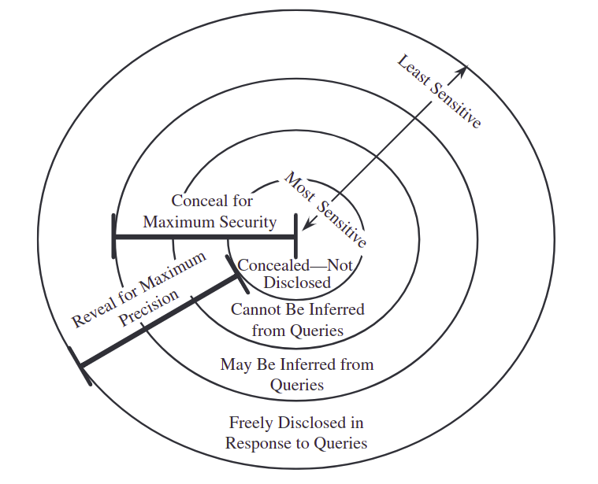
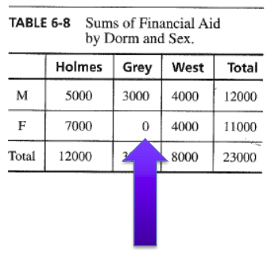
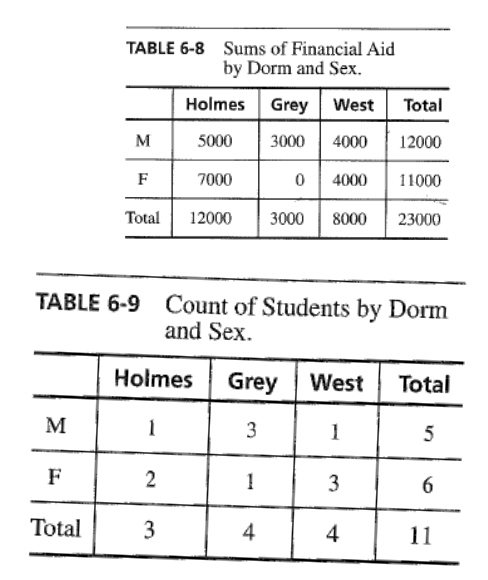

# Privacy Overview

Data is generated everywhere.

* Every click on-line
* user-generated
* Internet of things
* Health and Scientific computing

A 2013 study researchers were ablet o derive all the demographics of a person from a simple image on their social media account. 

In the adversarial model sometiems the data controllers "dehumanize the enemy by calling them data".

* To what extent can someone use data beyond the person's intentions?
* Who owns data?
* How do we value different aspects of privacy?
* How do users get informed consent?
* What does it mean to be fair?

# Data Science and Data

Predpol is a predictive policing service. The company adaptive an earthquake prediction algorithm to help predict crime hot spots that need police attention. In LA there's been a 33% reduction in buglaries and 21% reduction in violent crimes in areas where the software is being used. Some details that are privacy conerning are:

* area specific data from crime incidents is used
* sensitive data could be derived from non-sensitive data

Macy and other companies have also devloped price chaning algorithms. These algorithms essentially change prices for products in real time adapting to demand and inventory.

Yet another application of data science is Google's sponsored search. Google makes a revenue of $50 billion a year and 97% of that revenue comes from marketing. The sponsored search service uses an auction. This creates pure competition where companies try to win access to customers. Using data given by Google companies creating auction algorithms to have the right model in order to reach the right audience. Google has 30 billion requests a month.

Other applications of Data Science:

* Transaction Databases: Reccommendation system, Fraud detection
* Wireless Sensor Data: Internet of Things
* Text and Social Media Data
* Software Log Data: Automated Trouble Shooting
* Genotype Data: 23andMe, personliazed medicine

Five V's of Big Data

1. Volume: Raw Data
2. Velocity: Change over time
3. Variety: Data types
4. Veracity: Data quality
5. Value: Information for decision making

**It is hard to balance utility of data and privacy**

Privacy: State of being let alone and able to keep certain matters to one's self.

Types of Privacy:

* Personal Privacy
* Information Privacy
* Legal Privacy

In a Ted Talk by a researcher on privacy, there was an experiment performed at CMU. In this experiment the reserachers took a picture of someone and had them fill out a survey. While they filled out a survey they scraped the web with the picture. They were able to identify 1 in 3 people and could find SSN based of a picture and social media  profiles.

Case Study: OkCupid Data

* Who owns the data?
* How do we value different aspects of privacy?
* How do we get informed consent?
* What does it mean to be fair?

Consider:

* Consent
* Transparency
* Terms of Service
* Adversarial Model
* Limits on inference: Where do we draw the line?

# Overview of Data Privacy Issues

Privacy is a hard to define concept. Some examples of what it could be:

* Personhood
* Intimacy
* Secrecy
* Right to be let alone
* limited access to the self
* control over information

In this class we are focusing on privacy and not security, but security is a part of keeping data private.

Some inherently identifying information cannot be anonymized:

* genome sequences
* ancestry.com

Desires about data involve questions of trust. People must be willing to share information such as medical records, but are more likely to share with researchers and not pharama companies. Privacy is **not a binary value**.

Limited Acces:

* Laws to prohibit or limit collection, disclosure, contact
* tech to facilitate anonymous transactions

Control:

* Laws to mandate choice
* facilitate informed consent
* enforce privacy preferences

There are four facets of privacy:

1. Solitude: Separate from group, free from observation
2. Intimacy: put in a small unit
3. Anonymity: public but finds freedom from id/surveillance

Information privacy deals with collection of data and how it is stored. Decisional privacy deals with how end users decide to release or keep data.

Privacy and stakeholders:

* Company
* Customer
* Government
* data analyst
* data snooper/adversary

Confidential data definitions:

* Easily connected to a person providing it
* Could be agree to be kept confidential
    + business income
    + health/medical details
* conditioned by a number of factors
    + ethical guidelines
    + legal requirements
    + research specific consent agreement

## Data Analysis Workflow

1. Collection of Data
2. Filtering and Processing of Data
3. Analysis of Data
4. Publications and usage of data

## Privacy Violations

1. Information leakage (cookies on the web)
2. Inference (predictive analysis)
3. Information/data used in unwanted way (reccommendataions too personal)

Privacy Enhancing Technology

* VPN
* DuckDuckGo
* Wickr

Privacy Invasive Technology

* Amazon Echo
* Facial Recognition
* Location-based technology
* Venmo

# Economics of Privacy

Sumamry

* Data vs Decisional Privacy
* Collection
* Accessor Usage
* Dissemination of Data

Key Questions

* Adversarial Model: Who is the adversary? What is their space of actions?
* Mechanisms: Are the right mechanisms in place to achieve the privacy goal?
* Incentives: Will human and economic factors favor or disfavor the privacy goal?

Economics of Privacy

* Cost and benefits associated with protection or disclosure of data
* Data subject
* Data holder
* society as a whole

On a societal level the cost of privacy is not realized until the data is disclosed. On an individual level however the individual has some privacy control on their personal sphere. Even though individuals are in control of their data, there is inconsistent behavior. People **want** privacy, but often are not willing to **take steps** to protect it. Some possible reasons are they do not care, the cost of protection is too high, they don't understand the implications of their behavior, or they want immediate gratification and the cost is not a tangible concept.

Sample experiment using gift cards illustrated the **endowment effect**. This effect states that if a person perceives to already posses something they want to retain what they already have.

Does control enhance or reduce privacy? It is important that individuals have control, but think of the airplane versus the car. When you are in a car you are in control and feel safer, but statistically are in much more danger. This could be the same when it comes to privacy controls.

Key takeways are that people often don't understand the implications of their actions. When making cost benefit analysis people can only see the tangible consequences in front of them and often do not understand the full spectrum of outcomes that can come from their actions. This is also a reason why sometimes people are perceived to act irrationally.

## Privacy Laws around the World

Laws and regulations around the world vary. The US has a "patchwork quilt" when it comes to privacy laws and regulations. Laws and regulations are sector specific and often have minimal protections. Some regulators in the US are teh Federal Trade Commission and the Federal Communications Commission.

## Fair Information Practice Principles (FIPS)

1. Collection Limitation
2. Data Quality
3. Purpose Specification
4. Use limitation
5. Security Safeguards
6. Openness
7. Individual Participation
8. Accountability

# Laws and Directives

## European Data Protection

In Europe each country has their own commissions, but there is also a single law governing the entire union created in 2018: GDPR, General Data and Privacy Regulations.

### GDPR

* Doesn't matter where data is processed
    + Origin of data is Europe
* Explicit Consent must be given
* Data management
* Retained control
* Care for sensitive data
* Similar pillars to FIPS

## FIPS

### Collection Limitation

Collection limitation states that data must be collected for a specific purpose, so don't collect data not useful for that purpose.

### Data Quality

The data that is stored should stay consistent and accurate.

### Purpose Specification

Data is collection for a specific purpose.

### Use Limitation

The data is only used for the intended purpose.

### Security Safeguards

The proper security protections should be put in place to prevent data leaks.

### Openness

Data holders must be open about their policies.

### Individual Participation

Users should help contribute to data management.

### Accountability

The data holder is responsible for their actions.

## Privacy Risks in E-Commerce

* Unsolicited Marketing
* Subpoena
* Government Surveillance

One should start privacy analysis by identifying risks. What are the consequences and who could obtain the data?

# Protecting Sensitive Data

Definitions of sensitive data:

* Inherently sensitive such as SSN or Phone Number
* From a sensitive source
* Declared sensitive
* Part of sensitive record
* Sensitive with respect to other information

Types of data:

* Explicit Identifier (EI)
* Quasi Identifier (QI)
* Sensitive Data (SD)
* Non-Sensitive Data (NSD)

## Anonymization

1. Data masking: systematically remove identifiers
2. De-Identification: Modify Quasi-Identifiers to make id through them impossible

Generally of these two options de-identification is much harder. While data masking merely removes records from appearing, de-identification involves changing the data in a way that guarantees anonymity.

## Protecting data

There are various ways to protect data such as cryptography, anonymizaton and tokenization. Cryptography is generally not used, because when you protect data you do not want to lose the statistical significance found in the data. Cryptography removes almost all utility that one can derive from the data and generally privacy and utility gained from data is a balancing act. One example of what needs to be preserved is if there is a correlation between sensitive data and quasi-identifiers. This relationship needs to be preserved in the protection process. This could be income and zip code, which do not have the same meaning when replaced and generalized.

# Monetizing Twitter Case Study

## Background

Twitter was founded in 2006. From 2006 to 2010 Twitter was not generating revenue and was operating through venture capital. The Trio on top that had founded the company had to determine a valid business model and the most obvious solution was to follow in Facebook and Google's footsteps by monetizing their database of information. This business model is a perfect example of privacy versus value. The more specific to a single person you can get with sponsored ads the higher a price you can sell those ads for, but you are also totally violating privacy.

On a very basic level Twitter had to make sure that they were compliant with privacy laws. The two main players, since the US has the patchwork quilt, were Canada and the EU. Their stricter privacy laws were based on the FIPS principles and provided basic protections surrounding notice, purpose, consent, security, disclosure, access, and accountability. These laws required users to have control over how their data was used. Looking at the privacy policy of Twitter it is clear that they have done much to meet these laws and not protect the data much futher from what I can tell. Below is the quiz from Canvas pertaining to the discussion.

## Monetizing Twitter Quiz

Assuming  you are part of the Twitter Trio founder group,   what problems are there to face in terms of privacy, monetization, public backlash etc. ? 

As always there is a question of value vs privacy. Twitter could see from Google and Facebook that there were ways to monetize the use of databases containing personal information. Both Google and Facebook had begun to use this information for advertising, but both companies had faced backlash from privacy concerns, especially Google with their attempt at creating Buzz. Advertising to the person was Twitter's best bet in monetization, as it was already being done by companies, such as Dell. Dell had used the sales channel to garner $6 million over the course of 3 years.  The founders had to decide the best way to protect user privacy while using the user data to create a revenue for the company.

It seems to me that Twitter did monetize by selling user data to advertisers to increase sales, but they did so by following FIPS/ the privacy laws set forth in Canada and the EU. After reading the summary of these laws, which clearly reflect FIPS, and the Twitter privacy policy they seems to follow the summary to a tee. Twitter seems to just conform to the law and keep themself in the clear by putting the disclosure of information on the users at one point saying that users must be careful about what they post on Twitter, because by using the Services they consent to the use defined in the privacy policy. It is hard for the public to complain about this policy as it puts the blame of any unintentional leaks on the user them self, as long as Twitter has the proper security in place.

What issues exist with data privacy on the Internet? How does Internet technology threaten privacy?

The issue with data privacy on the internet is it is both easy to disclose information, but also hard to remove that information for existing on the Internet. Twitter points out in its policy that anything posted/done publicly is broadly and immediately disseminated through means of APIs and SMS. This points to the issue for the user. Even if companies are following the law it is hard to control any personal information disclosed on the internet, and usually any disclosure is legally the fault of the user unless there is some sort of breach at the company level, like Twitter have their direct messages being leaked publicly in 2008.

All user activity and information created and shared on the internet is stored in one way or another and this makes Internet technology inherently privacy invasive. Anything public on the internet can be scraped and use by a person even if you did not give that individual explicit consent, which is what makes your digital footprint so difficult to control. As the one list said perhaps the only way to live without have privacy breached on the internet is to live in a place without internet.

How might customers/users react to Twitter's proposal to mine its clients' data as a way to generate revenue for the company?

The reaction to this I think depends greatly on the wording of the action and the context of the situation. Mining client data as a phrase has a general negative connotation to it. People like having better services, but they also don't like to be thought of as a tool or object to be mined. Generally this would have a negative reactions, and probably greater so with revenue generation tagged on the end. An example can be seen with what the Library of Congress was trying to do. They said they wanted to archive every tweet that had been created since 2006, but received serious backlash. After going back and forth this eventually turned into only public tweets that hadn't been deleted for at least six months, and even then only qualified persons could access this archive. This allowed users more control over what was happening to their data and people like to be in control, but having their data "mined" would definitely upset them.

I think if Twitter phrased this as more as creating personalized ads to generate revenue there would be a much less severe backlash. People would not immediately associated this with Twitter using their personal information to monetize their services. Reactions are always how things are worded, which is often why Terms of Service are difficult to read, because companies generally don't want people noticing things that would make them upset.

What options does the Trio have, and what should they do?
Your Answer:
The Trio have three basic options in my head. The first option is the "throw away" option in which they do not change what they are doing and do not monetize. This would not be a good option for the company, but users would not be upset about having their data sold to advertisers. The second option would be allow for targeted advertising, but with data that has been anonymized. This still means that privacy for people are not being upheld fully, but if someone made the information public on the platform, Twitter should be able to use it right? The third option, which likely would not do well for monetization, would be to sell ads that were not targeted. This way companies would not be getting the personal information data, but Twitter could maybe still sell ads.

 

Of course Twitter should, as a business, chose the best option for both them and their users. They should choose a pareto optimal solution, which is why the second option is best. It provides useful ads for companies, and therefor better revenue for twitter, while maintaining some anonymity for their users. Of course I am not sure how feasible this option is, because adverts often like demographic information and we have learned that combining this information together often leads to identification anyway. There is definitely not a "solution" here for Twitter, but as a business they need to monetize or they will go bankrupt, and if they're following the laws regarding privacy, then is privacy invasion their fault or the user's?

What options does the Trio have, and what should they do?

The Trio have three basic options in my head. The first option is the "throw away" option in which they do not change what they are doing and do not monetize. This would not be a good option for the company, but users would not be upset about having their data sold to advertisers. The second option would be allow for targeted advertising, but with data that has been anonymized. This still means that privacy for people are not being upheld fully, but if someone made the information public on the platform, Twitter should be able to use it right? The third option, which likely would not do well for monetization, would be to sell ads that were not targeted. This way companies would not be getting the personal information data, but Twitter could maybe still sell ads.

 

Of course Twitter should, as a business, chose the best option for both them and their users. They should choose a pareto optimal solution, which is why the second option is best. It provides useful ads for companies, and therefor better revenue for twitter, while maintaining some anonymity for their users. Of course I am not sure how feasible this option is, because adverts often like demographic information and we have learned that combining this information together often leads to identification anyway. There is definitely not a "solution" here for Twitter, but as a business they need to monetize or they will go bankrupt, and if they're following the laws regarding privacy, then is privacy invasion their fault or the user's?

# Sensitive Data and Inference

For most privacy preserving approaches it is difficult to balance privacy and data utility. Data and databases are constantly under new attacks and new algorithms may need to be developed such as randomization and cryptographic approaches.

Privacy Preserving in Multidimensional data:

* Difficulty in identifying SD and QI
* High dimensionality
* Difficulty in achieving realistic balance between privacy and utility

## Relational Databases

### Relational Data and Queries

A query is a command that tells the database to retrieve, modify, add, or delete a field or record. An example of retrieval would be SELECT * FROM TableName WHERE BooleanCondition.

### Types of Disclosures

* Exact Data
* Bounds
* Negative result (not having a certain attribute)
* Existence
* Probable Value

An example of an attack on privacy is through inference. Data snoopers could try to infer or derive sensitive data from non sensitive data. A direct attack query would be SELECT name WHERE sex=M AND drugs=1. An indirect attack could be a release of statisical data such as the sum aid grouped by dorm and gender.

* Show Count, STUDENT-AID WHERE SEX=M ^ DORM=Holmes.
* List NAME where (SEX=M ^ DORM=Holme

Challenges in protection:

* High dimensionality
* Contextual information
* Inference from masked/aggregated data is always possible
* Balance between privacy and utility

Controls against inference attacks:

* Suppression - do not provide sensitive data
* Concealing - do not provide actual values (range or close to)
* Limited Response suppression - n-item k-percent rule eliminates low frequency values from display

## Suppression Techniques

### Limited Response Suppression

Limited response suppression eliminates certain low frequency elements from being displayed.

### Combined Results

Implement the use of rounding, ranges, sums and averages.

### Random sample

Release a different random sample of the data every time. You want to block small sample sizes.

### Random Data Pertubation

Randomly add or subtract a small error value to/from actual values to still preseve statistical observations.

### Swapping

Randomly swap values for individual records while keeping statistical results the same.

Recall preventing disclosure in relational data with supression and keep track of what each user already knows based off past queries.

## Iceland Case Study

Iceland has a large database with records from all citizens. This data set is homogenous data of medical records, genealogy, and genetic identifers. The homogenous properites can make inference fairly easy.

## Transactional Data

* Highly dimenionsal
* Sparse
* Conventional techniques do not apply
* Data is super specific

Recall the example with Target inferring preganancy and disclosing to Father based off purchase history. Important to keep purchase patterns in a generalized manner rather than tracking a specific person's purachases. To find patterns they use frequent itemsets containing 1 or more items. (k-itemset) The support count is the number of times that item set appears. The association rule states the item set x implies the item set y. You can evaulate this using support and confidence levels. Support (s) dictates how often X and Y both appear in the data set. Confidence (c) on the other hand dictates of the times you see x, how many of those times do you also see y.

## Longitudinal Data

* Data collected over time
* Repeated measurements of similar variables
* Easy to infer clusters even with identifiers removed/masked
* Clusters should be preserved

