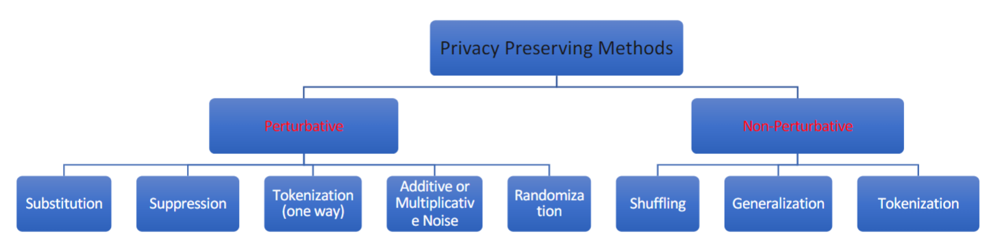
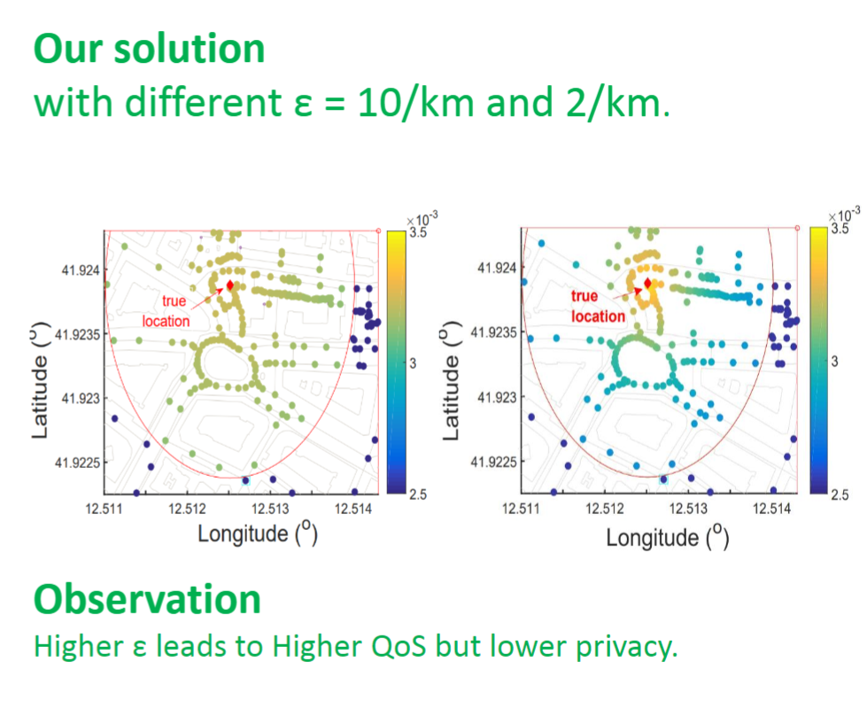

# Database Anonymization

There are two types of data that could be published from a database. **Microdata** represents a series of recoreds with each record containing information on an individual unit such as a person, a firm, or an instituion.  **Macrodata** represents computed/derived statistics such as aggregation. When deciding on what to publish it is important to consider both disclosure risk and information loss. **Disclosure risk** is the risk that a given form of disclosure will arise if the data is released. **Information loss** is the quanitty of information which exists in the initial data but not in the released data due to disclosure control methods.

```{r, out.width = "400px", echo=FALSE}

```

### Types of Disclosures

1. Membership Disclosure: Attacker cannot tell that a given person is in the dataset.
2. Sensitive Attribute Disclosure: Attacker cannot tell that a given person has a certain sensitive attribute.
3. Identiy Disclosure: Attacker cannot tell which record corresponds to a given person.

## Privacy vs Anonymity

Privacy deals with protecting sensitive data about a person. Three ways privacy can be invaded is from data leakage, unwanted inference, and data used in an unwanted way. Anonymity on the other hand deals with preventing certain data, sensitive or non-sensitive, from being identified with a specific person. This can overlap, but are not the same. 

## EI/QI/SD

* Explicit Identifier: An attribute that will uniquely identify an individual.
* Quasi-Identifier: An attribute that will partiall identify an individual on its own. Can help to identify an individual when combined with other attributes.
* Sensitive Data: An attribute whose disclosure would matter to the data subject like a credit card number versus favorite fruit (NSD). 

## Challenges with protecting QI and SD

In relational datasets some challenges with protecting the data include:

* High-Dimensionality
* Contextual-Information (Background)
* Inference from masked/aggregated data is always possible
* Balance between privacy and utility

# Challeneges with protecting Non-Relational Data

## Transactional Data

* Highly dimenionsal
* Sparse
* Conventional techniques do not apply
* Data is super specific

Recall the example with Target inferring preganancy and disclosing to Father based off purchase history. Important to keep purchase patterns in a generalized manner rather than tracking a specific person's purachases. To find patterns they use frequent itemsets containing 1 or more items. (k-itemset) The support count is the number of times that item set appears. The association rule states the item set x implies the item set y. You can evaulate this using support and confidence levels. Support (s) dictates how often X and Y both appear in the data set. Confidence (c) on the other hand dictates of the times you see x, how many of those times do you also see y.

## Longitudinal Data

* Data collected over time
* Repeated measurements of similar variables
* Easy to infer clusters even with identifiers removed/masked
* Clusters should be preserved

# K-anonymity

Each released record should be indistinguishable from at least k-1 others on its QI attributes. This also means the cardinality of any query results should be at least k.

## Generalization

In generalization you replace specific quasi-identifiers with more general values. An example of this would be using age ranges instead of a single age. Or using the decade of 10, 20, etc instead of exact age. K-minimal generalization is a generalization algorithm that meets the k-anonymity requirement with the most granular values possible.

## Suppression

When generalization causes too much information loss suppression is used. This is very common when there are outliers in the data, because it is difficult to include the outliers in the generalization.

## Equivalence Classes

Records that contain the same QI attributes. The cardinality of any given equivalence class should be at least k.

## Advantages

* Record linkage is avoided (for QI)
* Utility of transformed data is preserved
* Protection of outlier records can be achieved
* Correlation/association between QI and SD

# L-diversity

Entropy of sensitive attributes within each QI group must be at least L.

## Limitations

* Differing degrees of sensitivity for distirbutions (HIV+)
* Sometimes l-diversity is unnecessary (only HIV-)
* l-diversity can be difficult to achieve with a large numebr of records

# T-closeness

Distribution of sensitive attribtues in each QI group should be close to their distribution in the original database.

# Attacks to K-anonymity, L-diversity, T-closeness

There are some issues with syntactic privacy notions. It focuses on data transformation and now what can be learned from the data set. There is also the "quasi-identifier" fallacy where any attribute can effectively be a QI, not just the attributes labeled to be so. Often in these methods you are assuming the background knowledge of an attacker. These also methods also rely on locality and destroy the utility of many real-world datasets. Algorithms are also usually NP-hard.

## Linking Attack

Using background knowledge to re-identify a record based off sensitive data in an equivalence class. For example if you knew someone had heart disease, and they are the only record in the class with heart disease.

## Homogeneity Attack

If sensitive attributes in a certain equivalence class lack diversity, then the attacker could gain knowledge if all records have one value. (They all have heart diseases.)

## Complementary Release attack (Temporal)

Previously released attributes should be considered as QI. This is because this is background data that you know an attacker would have access to, whereas you are usually just guessing.

## Skewness Attack

An example of a skewness attack comes in the HIV data example. If 99% of recordes HIV- and an equivalence class has 10% of records that are HIV+, then you know people in a certain equivalence class are more likely to have HIV.

# Introduction to Differential Privacy

## Definition

Differential privacy attempts to ignore attack background knowledge and give similar results regardless of background information. Differential privacy adds some various amounts of noise to the true answer of a query.

## Laplace Mechanism

Using the laplace distribution to add a small amount of noise to the true answer of a query. Lap(S/$\epsilon$).

## Limitations

The number of queries must be limited or the noise added due to the distribution can be quanitifed using statistical sampling methods.

## Examples

* Sample GPA
* Geo-Indistinguishability

```{r, out.width = "400px", echo=FALSE}

```

# Challeneges and Methods to address anonymity in Graph Data

Graph data:

* Social Networks
* Electronics
* Software
* Telecom
* Business Data (Supply chain)

## Challeneges

* Node re-identification: deduce that node x in the published network corresponds to a real world person.
* Edge disclosure: deduce that two individuals x and y are connected.
* Sensitive Property inference: deduce that person x is HIV+.

## Limitations

A sample attack is a matching attack. The topology of a given subgraph of the entire graph can often be matched or narrowed down with auxilarry graph. With naive anonymization approaches, then some nodes can be re-identified based on their degree, which can then be iteratively deduced.

## Approaches (K-degree anon)

Often a transformed graph is empirically changed with respect to:

* degree distribution
* path length distribution
* clustering coefficient

One kind of transformation is alteration, which is changing the network topology by either adding, removing, or rewiring edges. You can also generalize by clustering nodes.

### Degree anonymization

Do k-anonymization on the degree of nodes. This owould require adding edges (or deleting) through alteration of the graph.

# Introduction to cryptography

The goal of cryptography is to ensure security of communication or data storage over insecure medium. This can include both privacy and integrity of the data.

A **cryptographic key** is a unique bit string used to decrypt and encrypt a message. Often encryption algorithms used are public, but keys are kept secret. This follows the philosophy that security by obscurity does not work. There are three types of algorithms.

1. Symmetric Crypotgraphy: Single key used for encryption and decryption
2. Asymmetric Cryptography: One key used for  encryption and another for decryption.
3. Hash function: There is not key and acts as one way encryption.


