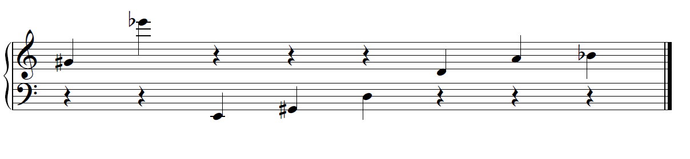

Directions: Save this worksheet with the filename “SOMProblemSet3-(lastname)”. Be completely sure that you have used the number 3 in the filename. Enter your answers directly into the document and save, then upload it into Canvas. Clearly show your work. If you are using an equation, write the equation down, then plug in values you are using on the next line.  When you are finished with a problem, draw a box around your final result or highlight it.  Leave at least a couple of spaces on the paper before starting your next problem.  Every answer should include the appropriate units. Remember to submit your homework by 10pm Monday.  No homework will be accepted late, so get it done early.

# Problem 1

It’s pretty obvious that if you walked into class and saw a small trumpet and a large tuba sitting next to each other, and the musicians came in to play them, the tuba’s various notes (and the fundamental frequency produced by its length) would generally be lower…octave(s) lower.  Why? What is it about the tuba’s construction that causes lower notes? Be more specific than “because it’s longer…”

# Problem 2

An uncoiled French horn would be about 13 feet long. Treated as an open-open pipe, what would its fundamental wavelength (in meters) be? What frequency (in Hertz (Hz)) would that be? And, what frequency would the second harmonic be? And, the third?

# Problem 3

By contrast, a piccolo is about 32 cm long. Treated as an open-open pipe, what would its fundamental wavelength (in meters) be? What frequency (in Hertz (Hz)) would that be? And, what frequency would the second haermonic be? And, the third?

# Problem 4

A bass clarinet (length, approx. 40 inches) behaves acoustically as an open-closed pipe. What is its fundamental wavelength (in meters), and its fundamental frequency?

# Problem 5

What frequency is an octave above a fundamental frequency of 262 Hz? (Hint: What is the ratio that resuilts in an octave?)

# Problem 6

What frequency is a perfect fifth above 300 Hz? 

# Problem 7

The speed of sound in Helium at 0 degrees Celsius is 970 m/sec.  When played using helium, the fundamental frequency of a clarinet, approx. 150 Hz., would sound much higher since helium’s speed of sound is faster than air at that temperature (only 331 m/sec). What would the new fundamental frequency be? 

# Problem 8

If you pluck a string and hear an A (110 Hz), what are the frequencies of the first four harmonics (the first three overtones) including the fundamental?

# Problem 9

Find videos of two of these instruments: Hurdy-Gurdy, Sackbut, Erhu, and Shawm. Describe their timbre using the musical adjectives sheet found in our Canvas files page.

# Problem 10

On the musical grand staff below, write the name of each pitch. Then, find and circle the three adjacent notes that best represent an open-open pipe’s “fundamental – first overtone – second overtone” relationship. 

