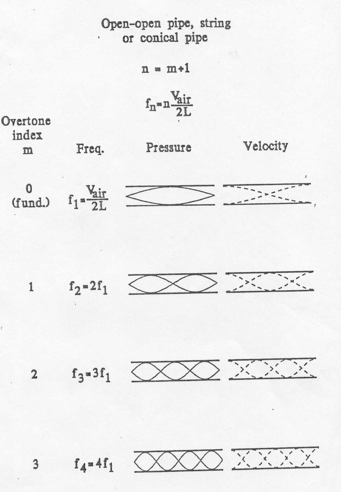
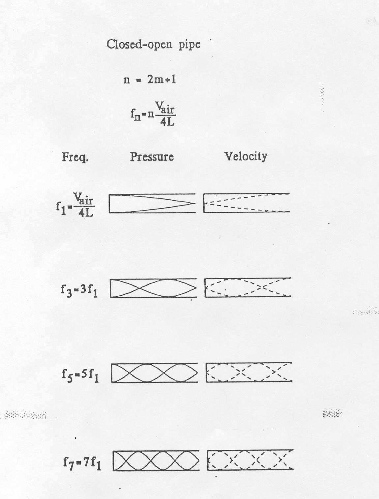

# What is Sound

EXPLAIN WHAT WAVES ARE (INCLUDING WAVELENGTH)

# Variables to Know

$$
\begin{array}{ |c|c|c|c|c|c|c|c| }
 \hline
 Variable & Abbreviation & Units & UnitsAbrv & Misc\\
 \hline
 Frequncy & f & Hertz & Hz & \frac1{sec} \\
 SpeedOfSound & C(V_{air}) & Meters/Second & m/s & 344 m/s\\
 Wavelength & \lambda & Meters & m & \\
 Length & L & Meters & m\\
 \hline
\end{array}
$$

# Equations to Know

Wavelength:

\[\lambda = \frac{C}{f}\]

Open-Open Pipe fundamental:

\[f_1 = \frac{C}{2L}\]

The open-open pipe is also called a half wave resonator, strings also follow the half wave resonation pattern. The overtones follow increasing consecutive integer harmonic multiples. Below is an illustration of the half wave resonator sound waves.

Open-Close Pipe fundamental:

\[f_1 = \frac{C}{4L}\]

The open-closed pipe is also called a quarter wave resonator. The overtones follow an increasing consecutive odd integer harmonic multiples. Below is an illustration of the quarter wave resonator sound wave.

)

# Sound Intensity Level

# The Amazing Ear

