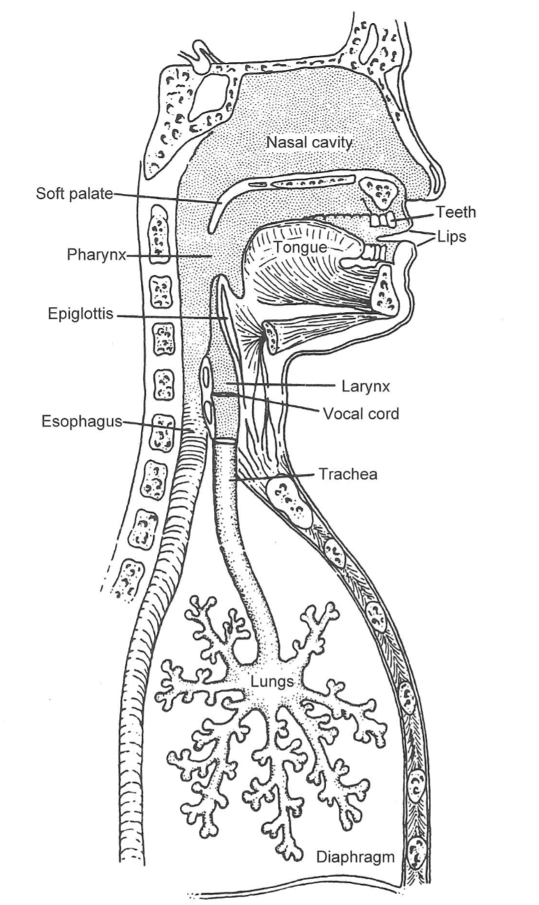

# Instruments

## Categories of Instruments

* Chordophone - A chordophone is a string instrument such as a harp or banjo.
* Aerophone - An aerophone is a wind instrument such as a trombone or saxophone.
* Idiophone - An idiophone is an instrument you strike such as chimes, marimbas, or crotales.
* Membranophone - A membranophone is an instrument that uses a membrane such as a snare drum or timpani.
* Electrophone - An electrophone is an electronic instrument such as a moog synthesizer.

## Three Components of an Instruments

1. Energy Source 
    + The energy source for an instrument provides an input for vibration to occurr. Some sort of energy input from a player must create the mechanical energy required to vibrate the primary oscillator.
2. Primary Oscillator
    + The primary oscillator is the main vibrating body in an instrument; which the rest of the instrument acts as a resonator for. This could be strings on a chordophone or lips for a brass player.
3. Secondary Oscillator/Resonator
    + The secondary oscillator/resonator is often the body of the instrument. The resonator helps to create sustain and transform the sound from the primary oscillator.

## Transposition

Transposition is the act of transforming pitches to different notes on the scale. For example, I can play an alto and tenor sax with the same key fingerings for the same notes on sheet music, but if I play the same fingering for both instruments it will not be the same note. This is what transposition is. Often we denote an instrument based off its key. For example an E flat clarinet.

# Brass Instruments

## Instrument Concept

## Instrument Examples


# Woodwind Instruments

## Instrument Concept

## Instrument Examples


# Vocal Instruments

```{r, out.width = "400px", echo=FALSE}

```

## Phonemes

Voiced means vocal chords are involved

* Plosives - "Puh"
* Voiced Plosives - "Buh", "Duh", "Kuh"
* Fricatives - "F", "Sssss"
* Voiced Fricatives - "Shhh", "Vvvvvvvv", "Thh"

# String Instruments

## Parts of a Violin

```{r, out.width = "400px", echo=FALSE}

```

Instruments also have directionality. For example the violin:

```{r, out.width = "400px", echo=FALSE}

```

# Percussion Instruments

# Room Acoustics

Keep in mind some basic asorption concepts. High frequencies have short wavelengths. They are caught many places such as hair, seat material, people, and curtains. Low frequencies with bigger waves need large cavaties to be caught in, such as the large curtains in the recital hall.

## Qualities in Room Acoustics

* Liveness/Reverb - Amount of meaurable reverb time. Theatrical spaces are more dead for clarity, but instrumental and choral spaces are more live. This quality is usually measured at 500 Hz.
* Intimacy - This is related to the amount of direct sound received from the performers. A more intimate setting would have more direct sound.
* Loudness - The general pressure level experienced by the listener. Diminished by absorption.
* Fullness - A type of longer reverberation achieved when the ratio of reflected to direct sound is higher.
* Clarity - A type of shorter reverb, which is the opposite of fullness.
* Warmth - When reverb time for low frequencies is greater than high frequencies. 
* Brilliance - The opposite of warmth.
* Uniformity - A uniform aural product is heard regardless of location in the hall.
* Envelopment - The sense of sound arriving from all directions. Often absent in open air performance.
* Texture - Pertaining to the arrival of various reflections to the listener.
* Blend - The mixing of sound from all the instruments on stage.
* Ensemble - Ability of the performers on stage to satisfactorily hear each other.

## Problems in Design

* Focusing - Hotspots of sound can occur in an area of the audience. Why concave walls are avoided.
* Echoes - Detrimental to clarity along with flutter from parallel walls. Creates a repetition of notes.
* Shadows - Dead spots in halls due to diffraction and absorption.
* Resonances - Smaller rooms can have their resonant frequencies matched.
* External noise - comes from HVAC, traffic, etc.

## Absorption Coefficient

The absoption coefficient of materials determines how effective a certain material is at aborbing the pressure waves of sound at certain frequency. Often softer materials are better at absorbing and better at absorbing at higher frequencies. An example table of these coefficients is located below.

```{r, out.width = "400px", echo=FALSE}

```

## Room Modes

Rooms have resonances just like any other cavity. Our rule of thumb to determine the resonant frequency is to use the longest dimension as 1/2 the wavelength of the resonant frequency. D here is the longest dimension:

\[f = \frac{344}{2*D}\]

## Reverb Time

Reverb time is a measurement of how long the sound pressure level in a room takes to decrease by 60 dB or by a factor of 1 million. The equation to calculation RT (Reverb Time) is lcoated below:

\[\text{RT} = 0.161\frac{V}{\Sigma_{i=1}^na_iS_i}\]
\[\text{V = Volume}\]
\[\text{a = absorption coefficient}\]
\[\text{S = Surface Area}\]

# Tuning Temperaments

An instrument can be tuned so each note sounds as made to specification. A piano or chordophone has a lot of room for tuning. Each string on a chordophone can be changed while tuning, but a brass or woodwind instrument can merely slide a tuning slide or mouthpiece to adjust on the fly. These aerophone are often produced with a certain tuning system in mind. Also keep in mind that different cultures have different scales.

## Microtones

A microtone is a pitch that is in between pitches on a scale. For example, even with the same tuning system a 12 note scale will have microtones of a 5 note scale, because some of the pitches come in between the notes on that scale.

## Pythagorean Temperament

The pythagorean tuning system is perhaps one of the oldest. The tuning in this sytem follows one simple rule. In order to find the pitch of each note you start on a base note. From that base note you go up a perfect fifth interval and assign that frequency to the given pitch. This is done until all 12 notes in our modern scale are fileld in.

## Just Intonation

Just Intonation is a tuning system that focuses on tuning to intervals. Given a certain base note the rest of the scale has the pitches filled in based off the proper ratio of intervals. The good part of this system is that in the base key all notes are beatless given the perfect intervals, but it is essentially tuned to a specific key, since if you try to play in another key it will sound pretty bad.

## Equal Temperament

Equal temperament is a tuning system that attempts to solve the issue of being able to play in more than one key. The idea behind equal temperament is that each half note step in our 12 note scale will have the same distance from each other. Since we want to keep the octave as a doubling in frequency we use the twelfth root of 2 as a the distance between each half note. We then based everything off a certain pitch in the scale. Today it is often A=440.

# Electrophones

## Compressor

A compressor enables you to shape a sound. You can suppress louder sounds and increase the level of quieter sounds. There are also options for attack, decay, sustain, and release, where anything in the threshold will be affected.


