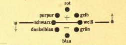
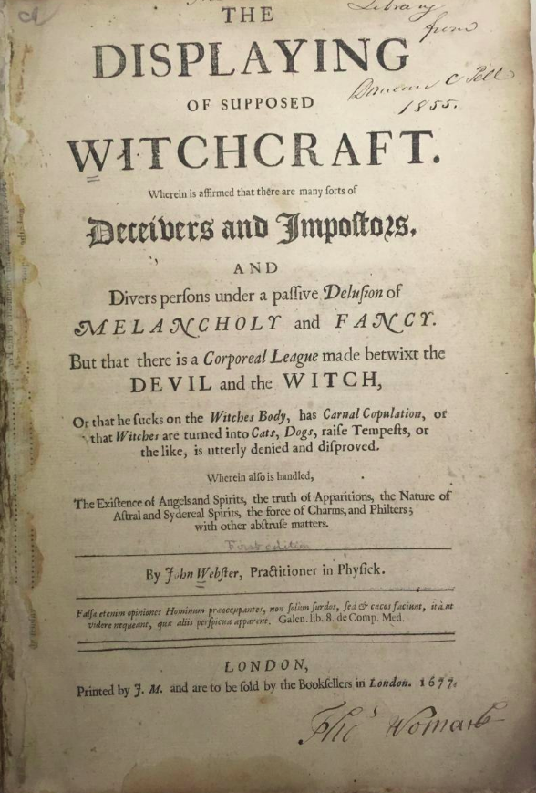

# Source 1

## Source Information

### Call Number

QD26.M32 1920

### Title

Das Wesen der Alchemie

### Author(s)

Dr. Ferdinand Maack

### Date(s) of Publication/Creation

1920 ish

### Place of Publication

Germany (Wurttemburg)

### Image/Maps

There is a diagram for color theory.

### Descriptive Information

The book appears to be a part of a series called the Occult World. It would be the 18th book in the series.

### Why this item?

I chose this item, because it was in German and it had a simple title. I wanted a book in another language that I could read, so I chose this. I also thought something on Alchemy would be interesting, because I like science/chemistry.

## Item as an Object

### What kind of source?

This book is part of some sort of anthology or series of books. It is possible that the series was sold in a newspaper like fashion, because the inside cover and back page both had a newspaper layout of text.

### Printed?

This item is printed.

### Distinctive Cover Page

The title page for this book is very simple. It states the name of the series, title of the book, the author, and publisher.

### Visually Interesting

There is not much visually interesting in this book besides the color theory diagram and the pages on either end of the book, which has a big title: "Souls, who lost their life!"

## Content

### Topics Addressed

This book seems to be a scientific text. It talks about alechemy from a scientific perspective talking about the new concept of radioactivity (at the time). The book also addresses Goethe's color theory book about how we perceive color. It is also possible that the author viewed chemistry or alchemy as dark or magical.

### Intended Audience

The inteded audience was likely the average person, because the book appears designed to be mass produced, because there is no text and it is smaller and black and white, which would make it easy and cheap to print a lot of them.

### Exciting Items

I thought the diagram in the book from color theory was really interesting, You can see the color version of this on the color theory wikipedia page.

### Witchcraft Iconography

There was no witchcraft iconography in this book from what I could tell. It was a very scientific text and the only real notion of it being related to the Occult was the name of the series it was in, so it is possible there is something that I missed.

## Digital Content on the Web

### Author Wikipedia

It is possible that this is the author: https://en.wikipedia.org/wiki/Ferdinand_Maack

### Digital Version

https://archive.org/details/b29295075/page/n4 

# Source 2

## Source Information

### Call Number

BF1033.A2 1900

### Title

Das 13. Buch Moses

### Author(s)

Unknown

### Date(s) of Publication/Creation

1900s (early)

### Place of Publication

Germany

### Image/Maps

There is no images, but a very fancy font.

### Descriptive Information

This item is called the 13th book of Moses and the supposed 6th and 7th books are thought to magical books, so that may have something to do with the title.

### Why this item?

I chose this item, because I like to look at how religion relates to other subjects. I have a fairly good base knowledge of the catholic religion and its history, so when I saw the title I pulled it.

## Item as an Object

### What kind of source?

This source is some sort of a religious book. It appears that it could be a commentary about current events written from a religious perspective.

### Printed?

This source is printed.

### Distinctive Cover Page

The cover page is essentailly just hte title and description.

### Visually Interesting

There is not much visually that is interesting in this piece. It is mostly fancy font text.

## Content

### Topics Addressed

This book is a religious text. It appears to be written more recently talking about "spirit of a new era". It appears to be a new writing about current events at the time, essentially a commentary from a religious point of view. This book reminds me of the book from mormonism, which is relatively new and uses the book of moses.

### Intended Audience

The intended audience would be those that are religously devout that are looking to explain the world around them.

### Exciting Items

I thought the title was really interesting. Maybe the thirteenth book of moses was an actual popular religious book, but I could not find anything about it online, except that the 6th and 7th book of Moses are supposedly about magic, and 6 + 7 is 13.

### Witchcraft Iconography

The only part of witchcraft that I could find with this book was the tidbit about the 6th and 7th book of Moses.

## Digital Content on the Web

### Author Wikipedia

I don't know who the author is to look up.

### Digital Version

I could not find a digital version of this item, just copies to buy.

# Source 3

## Source Information

### Call Number

BF1565.W43Q

### Title

The displaying of supposed witchcraft: Wherein is affirmed that there are many sorts of deceivers and Imposters, and divers persons under a passive delusion of melancholy and fancy. But that there is a corporeal league made betwixt the devil and the witch, or that he sucks the witches body ... or the like, is utterly denied and disproved. Wherein also is handled, the existence of angels and spirits, the truth of apparitions ... the force of charms, and philters; with other abtruse matters.

### Author(s)

John Webster

### Date(s) of Publication/Creation

1677

### Place of Publication

London

### Image/Maps

There are no images, but there is a decoration on the first page of the book.

### Descriptive Information

This book and title page seem very typical for the time. The title is long and descriptive.

### Why this item?

I chose this item, because attention was brought to it in class. The title is very enticing, which likely helped to sell copies at the time. I also chose this item, because the title included many aspects that we have seen in the show Supernatural that I watch with my girlfriend.

## Item as an Object

### What kind of source?

The item is a large book or tome. The book seems like a sort of reference manual for anything supernatural.

### Printed?

This is a printed source.

### Distinctive Cover Page

The cover page is distinctive in the sense that it is eye catching in the way it is designed. Not only is the title interesting, but it is designed to highlight interesting words such as witchcraft, deiceivers, imposters, devil, and witch.

### Visually Interesting

I find the design of the font of the parts of the title really interesting. It is as if the standard title is really large (Displaying Witchcraft) and then certain related subtitles are highlighted in other fancy fonts like melancholy paired with fancy, and devil paired with witch.

## Content

### Topics Addressed

The book appears to be a reference manual for all things supernatural. It has various accounts of encounters with the supernatural like witches and spectres. Whether the accounts are true or not is unknown, but it would act as a guide for the owner to know what to do if they had supernatural encounters or thought they might be having a supernatural encounter.

### Intended Audience

The intended audience for this book would have been richer folk that would have this book as a sort of novel item. The book is large, so it is clearly not used for portable reasons, and at the time only richer folk would be able to afford the binding and be able to read it.

### Exciting Items

The book mentioned fallen angels, which I found really exiciting, because that is a recurring topic in the show Supernatural that I mentioned watching before. 

### Witchcraft Iconography

This book is riddled with themes of witchcraft. It connects witches to the devil once again and talks about them doing his bidding.

## Digital Content on the Web

### Author Wikipedia

There is an entry on John Webster: https://en.wikipedia.org/wiki/John_Webster_(minister)

### Digital Version

https://collections.nlm.nih.gov/bookviewer?PID=nlm:nlmuid-2426036R-bk#page/1/mode/2up

